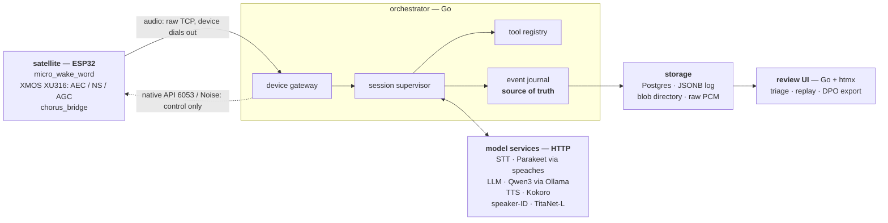

# Chorus

**Your voice assistant shouldn't go deaf while it talks.**

Barge in. Bring someone else into the conversation. Walk into another room.
Chorus keeps up.

It replaces Home Assistant's Assist pipeline for ESP32 voice satellites
(FutureProofHomes Satellite1, HA Voice Preview Edition). Assist has three hard
limits: it can't speak and act at the same time, interruption loses the
conversation, and its trace data is too thin to learn from.

- **Full duplex.** The mic never stops, even during playback. Interrupt
  mid-sentence and the turn is truncated at the byte the speaker actually
  played — not at the byte the model sent.
- **Knows who said what.** A speaker embedding per utterance, so when someone
  else chimes in, Chorus re-attributes the turn *inside* the same conversation.
- **Follows the person, not the device.** The conversation belongs to whoever is
  talking; the audio stream belongs to the satellite. Wake on another satellite
  and pick the same thread back up.
- **Everything is replayable.** The orchestrator is a pure reducer over an
  append-only event log. Tracing isn't instrumentation; it *is* the runtime.
  Every barge-in produces a preference pair, and `replay()` is a tested
  function.

Built for one household, 2–10 satellites, and local models. Chorus isn't a Home
Assistant integration; Home Assistant is one tool backend among several.

## Status

**Phase 1, in progress.** The device bridge, session engine, and event journal
are built, and `cmd/chorusd` now runs them together as the orchestrator daemon;
it has not yet been run against a real satellite. What exists today:

| Piece | State |
|---|---|
| `cmd/chorusd` — the orchestrator daemon: accepts satellites, one session supervisor per link over a shared journal, holds each device's native API open | under test against the in-process satellite; unproven on hardware |
| `internal/esphome` — native API client, Noise transport | dials real hardware |
| `internal/bridge` — the audio link, and `bridgetest`, the in-process satellite that is the primary test asset | under test; full duplex proven on hardware (§3.3.2) |
| `internal/session` — actor/supervisor, speech channel, barge-in gate | under test |
| `internal/journal` — append-only log on Postgres, `replay()` | under test |
| `internal/satellite` — renders speech onto a device; the truncation point is the DAC's | under test |
| `internal/blob` — the audio a journal event refers to | under test |
| `esphome/components/chorus_bridge` — firmware component | runs on a Satellite1 |
| `cmd/probe` — connect to a satellite and dump what it exposes | works |
| LLM — `internal/provider/ollama`, the turn engine | dials a real endpoint |
| TTS — `internal/provider/kokoro`, resampled to the device's rate | dials a real endpoint |
| STT — `internal/stt` partials over `internal/provider/speaches` | measured against real Parakeet TDT 0.6B v2 on CPU |
| speaker-ID — `internal/identity` over `internal/provider/speakerid` and `sidecars/speakerid` (TitaNet-L on ONNX) | thresholds measured on 37 speakers; sidecar runs without Docker |
| `internal/hass` — the one real tool (SPEC §14 item 5) | verified against Home Assistant 2026.10 |
| `internal/listen` — the Listening child: mic stream to utterances, barge-in candidates, attribution | under test |
| `internal/harvest`, `cmd/harvest` — barge-ins as DPO candidates | under test |
| `cmd/reviewui` — Browse, Triage, Review, Replay, Curate and Export over the journal ([guide](docs/reviewui/README.md)) | under test, in a headless Chrome too |
| `internal/triage` — barge-ins, failures, repeated asks, slow answers and speaker flips, derived on read | under test |
| `internal/rerun` — edit-and-replay: a conversation's turns asked again under another prompt or model | under test |
| `internal/curation` — a reviewer's verdicts, in a table beside the journal | under test |

`task spec` reports which spec clauses have tests behind them.

## Architecture



Polyglot by seam: Go where it's a concurrent socket server, Python where the
ecosystem is Python. No shoehorning either direction. The model services are
off-the-shelf servers behind small Go clients in `internal/provider`; the one
Chorus owns is the speaker-ID sidecar in `sidecars/speakerid`. SPEC §10 is the
stack and its alternatives.

The device is the TCP server and the controller is the client, so Chorus dials
out — `aioesphomeapi` is the reference implementation. Audio cannot ride the
native API without forking `api.proto`, which is why `chorus_bridge` opens its
own socket. Stock `voice_assistant` is removed from the device YAML entirely.

## Install

Needs Go 1.27+, [`uv`](https://docs.astral.sh/uv/) for the Python sidecars, and
Docker for the journal database. Everything else — `buf`, `cue`, `gofumpt`,
`golangci-lint` — is pinned and installed by `task tools`.

```sh
go install github.com/go-task/task/v3/cmd/task@v3.54.0

git clone git@github.com:Teagan42/Chorus.git
cd Chorus
task tools      # pinned toolchain into GOPATH/bin, plus the git hooks
task check      # lint + codegen drift + tests + doc examples + spec trace
```

`task check` is the gate. It runs in seconds and is identical in CI. If it
passes, you have a working clone.

## Running

### Against the fake satellite

The hermetic test suite needs no hardware, no GPU, and no network. The fake
satellite (`internal/bridge/bridgetest`) speaks the real `chorus_bridge`
framing in-process, and the native API client is tested over an in-memory
pipe with the real Noise handshake:

```sh
task test
```

Concurrency and interrupt timing are where this project's bugs live, and they
cannot be tested repeatably against hardware. That makes the fake the primary
test asset rather than a convenience.

### Against a real satellite

Flash the firmware, then point the probe at it.

```sh
cd esphome
cp secrets.example.yaml secrets.yaml      # wifi + api encryption key
cd ..

task firmware:config                      # validate before flashing
task firmware:compile                     # downloads ESP-IDF on first run
task firmware:upload                      # over the air
```

`satellite1.yaml` is the real FutureProofHomes Satellite1 wiring and is what
the firmware tasks build by default. Set `orchestrator_host` in it to the
machine running the orchestrator — a literal IP on a static lease, because
ESPHome cannot resolve hostnames for an outbound socket.

**Do not flash `satellite1.example.yaml`.** Its I²S pins are generic ESP32-S3
placeholders, there so the file validates standalone — they are not any real
board's wiring. It exists to exercise the config schema, not to run.

Then describe the device to the host side:

```sh
cp devices.example.yaml devices.yaml       # gitignored; psk is the base64 api key
task probe -- -listen 10s
```

`probe` completes the Noise handshake, prints the device info and entity list,
and then streams incoming messages for as long as you asked. It is the phase-1
spike: proof the connection can be owned without Home Assistant.

### The journal database

```sh
task db:up        # Postgres, waits until healthy
task test:db      # the db-tagged tier
task db:down      # stop, keep the volume
```

### Run the orchestrator

The daemon reads the satellite inventory from `devices.yaml` and everything
else from the environment, which `task run` loads from a gitignored `.env`.

```sh
task db:up                                # the journal; migrations run at startup
cp .env.example .env                      # model endpoints, blob directory, HA token
task run                                  # go run ./cmd/chorusd
```

It fails at startup naming every variable that is missing. The speaker-ID
sidecar and Home Assistant are optional and say so in the log when absent:
without the first everyone is a guest and barge-in gates on energy and words
alone, so the television can interrupt (ADR-0031); without the second the
`ha_*` tools answer `not_implemented`, which the model sees. Point
`orchestrator_host` in the device YAML at this machine, and the satellites
dial in on port 6055. `docker compose up chorusd` runs the same daemon as an
image beside the database.

The model services start locally one task each: `task stt:up`, `task tts:up`,
and `task speakerid:up` (or `task speakerid:serve` without Docker). Ollama is
yours to run.

### Review what happened

```sh
task reviewui                             # http://localhost:8080, same .env
```

The review UI reads the journal and the blob directory `chorusd` writes:
browse the day per satellite, triage what's worth a look, listen to each
barge-in cut where the speaker actually stopped, re-run a conversation under
an edited prompt, curate the pairs, and download the DPO dataset.
[`docs/reviewui/README.md`](docs/reviewui/README.md) walks every screen.
`task harvest -- <conversation-id>` writes one conversation's raw candidates
from the command line: every barge-in, uncurated, with no `chosen` side
(`meta.curated=false`), so it is for inspection, not training. The curated
dataset comes from the Export screen.

## Tests

Five tiers, separated because four of them cannot run everywhere. `task check`
is the gate; the others are what the gate can't demand of every machine.

| Task | Needs | Runs |
|---|---|---|
| `task test` | nothing | hermetic suite, included in `task check` |
| `task test:db` | Postgres (`task db:up`) | separate CI job, every push |
| `task test:e2e` | Chrome or Chromium (`CHORUS_E2E_CHROME`) | separate CI job, every push |
| `task test:models` | GPU sidecars | self-hosted runner |
| `task test:hardware` | a real satellite | self-hosted runner, manual |

Hermetic means hermetic: no network, no wall clock, no GPU, no device. A test
that reaches the network is a bug in the test.

## Documentation

| Where | What |
|---|---|
| [`docs/SPEC.md`](docs/SPEC.md) | Normative. Tests cite the clause they verify. |
| [`docs/adr/`](docs/adr/) | Every architectural decision, and why each one went that way. |
| [`docs/reference/`](docs/reference/) | Generated from the CUE schemas — events, tools. |
| [`docs/reviewui/`](docs/reviewui/README.md) | The review UI: running it, every screen, its browser tests. |
| [`esphome/README.md`](esphome/README.md) | The `chorus_bridge` wire protocol. |
| [`sidecars/speakerid/README.md`](sidecars/speakerid/README.md) | The speaker-ID sidecar and its embed contract. |
| [`CHANGELOG.md`](CHANGELOG.md) | Every release, written by release-please. |
| [`CONTRIBUTING.md`](CONTRIBUTING.md) | Five rules. Read before the first PR. |

Docs are build artifacts or they are executed: `task test:docs` extracts and
runs the code examples, and `task spec:check` fails on spec clauses that claim
coverage they don't have.

## Contributing

Tests first — a bug gets a failing fixture before a fix. Schemas are the source
of truth, so generated types and docs are never hand-edited. Commits are atomic:
generated, dependency, formatting, and behavior changes never share one.
[`CONTRIBUTING.md`](CONTRIBUTING.md) has the detail, and `task check` enforces
what it can.
