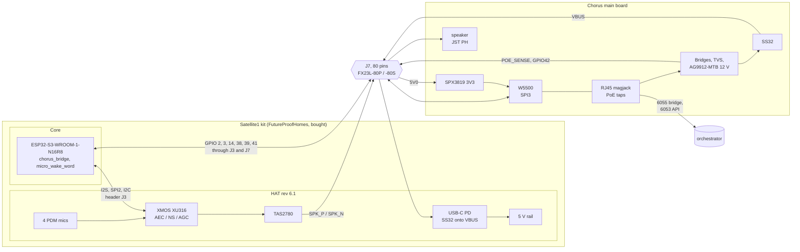
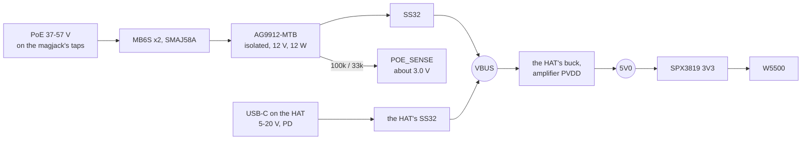

# The Chorus main board

A Chorus satellite is a FutureProofHomes Satellite1 kit, bought as is: their
HAT, with the XMOS XU316, the four mics, the amplifier and the USB-C power,
on their Core, with the ESP32-S3. Chorus designs one board of its own, the
**main board**. It sits under the HAT on the HAT's 80-pin expansion
connector, J7, and adds the one thing SPEC §3.3.2 measured that firmware
cannot fix: a cable. It carries a W5500 for Ethernet, 802.3af PoE onto the
HAT's VBUS, and a speaker connector in the base.

This is rev A of the main board: a machine-checked design, not a fabricated
board. One footprint pad assignment is inferred rather than read, and
[what is still open](#open-questions) says which, and what settles it.

The decision and what it replaced are
[ADR-0055](../adr/0055-the-satellite-is-a-bought-satellite1-kit-and-chorus-draws-only-the-board-under-it.md).
The pin map, which the schematic's net labels and the board's ESPHome config
both come from, is [`hardware/chorus-main/pins.yaml`](../../hardware/chorus-main/pins.yaml).
The kit's connector, pad by pad, is
[`satellite1-hat.yaml`](../../hardware/chorus-main/satellite1-hat.yaml) beside
it. [`internal/board`](../../internal/board/expansion.go) holds one to the
other on every `task test`.

## What the kit does, and what the main board adds

| Chorus property | Who does it | How |
|---|---|---|
| The mic never stops, even during playback (SPEC §3.1) | The kit | The XU316 runs AEC against its own playback path, as SPEC §3.3.2 measured on this very hardware |
| Per-utterance speaker embeddings follow the person (SPEC §5) | The kit | Every satellite is the same Satellite1 frontend, so a voiceprint enrolled at one matches at the next |
| Duplex needs airtime, not bandwidth (SPEC §3.3.2) | The main board | W5500 Ethernet, on its own SPI bus, so a frame in flight never waits on the XMOS |
| One cable to a ceiling or wall satellite | The main board | 802.3af PoE into a Silvertel AG9912-MTB, 12 V onto the HAT's VBUS through a Schottky |
| Hardware mute is authoritative (CONTRIBUTING §7) | The kit | The HAT's mute switch |
| A bad flash is recoverable without a teardown | The kit | The Core's USB-C and BOOT button; the main board leaves both alone |

## Block diagram

The kit's own wiring is untouched. The ESP32's pins reach J7 through the
HAT's J3 socket and the Core's 2x20 header; the main board uses only pads the
kit leaves free.

## The expansion connector

[`satellite1-hat.yaml`](../../hardware/chorus-main/satellite1-hat.yaml) is J7
as FutureProofHomes drew it: every one of its 86 pads, the HAT's own label,
what the kit puts there, and for the ESP32's pins the GPIO behind it and where
[`esphome/satellite1.yaml`](../../esphome/satellite1.yaml) sets it. It is read
from the HAT rev 6.1 schematic, the Core rev 4.1 and 5.1 headers, which agree
pin for pin, and the shoe, FutureProofHomes' prototype board for the same
spot. `internal/board` checks the main board's receptacle against it:

- the receptacle has exactly the plug's pads;
- a pad the HAT leaves unconnected stays unconnected;
- every one of the kit's fifteen ground pads is on `GND`;
- a pad the kit uses is either unconnected here or on the kit's net, under
  the kit's name for it;
- a free GPIO pad is unconnected or carries the `pins.yaml` net for that
  GPIO;
- a net named like one of the kit's must reach it, so `CORE_3V3` on this
  board cannot be anything but the Core's 3V3.

A test also proves no `pins.yaml` GPIO is one the running config sets, and
that every GPIO the config sets which reaches J7 is marked as the kit's.

Eight of J7's pads carry a GPIO nothing on the kit uses: 2, 3, 14, 18, 38,
39, 41 and 42. The main board takes seven:

| Net | GPIO | J7 pad | HAT label | Why there |
|---|---|---|---|---|
| `ETH_RST_N` | 2 | 13 | GPIO02 | the shoe's W5500 reset |
| `ETH_INT_N` | 38 | 33 | GPIO13 | the shoe's W5500 interrupt |
| `ETH_CS_N` | 3 | 37 | GPIO03 | the shoe's W5500 select; a strap read only with an eFuse no Satellite1 burns, pulled up regardless |
| `POE_SENSE` | 42 | 36 | GPIO42 | the shoe's AT_DETECT |
| `ETH_SCLK` | 39 | 22 | GPIO04 | free |
| `ETH_MOSI` | 41 | 16 | GPIO16 | free |
| `ETH_MISO` | 14 | 31 | Reserved_2 | free |

The HAT's labels are its own names for the pads, not the GPIO behind them:
"GPIO16" is GPIO41, "GPIO13" is GPIO38. The kit file keeps both.

The shoe puts its W5500 on the XMOS's SPI bus. This board does not. The XU316
has to answer over that bus before any audio flows (SPEC §3.3.2), so a
network transaction never shares it: the XMOS keeps SPI2, as the running
config sets, and the W5500 gets SPI3 on its own pins.

GPIO18 stays free for whatever comes next.

## The receptacle

The HAT's plug is a Hirose FX23L-80P-0.5SV8 (LCSC C3649601); the main board
carries its mate, the FX23L-80S-0.5SV(20), as the shoe does. KiCad has no
footprint for it, so
[`chorus-main.pretty`](../../hardware/chorus-main/chorus-main.pretty/README.md)
draws one from the shoe's 3D model: 80 tails at 0.5 mm in two rows 9.7 mm
apart, two fixing tabs, and four plated holes for the power contacts.

Which pad is which comes from FutureProofHomes' own boards:

- the shoe's silkscreen marks pin 1 at the +x end of the row nearer the
  board's centre;
- that row is the one routed out in full, as pads 1-40 are;
- the protoboard labels its breakouts "1" and "41", both at the +x end, one
  above each row.

The four power contacts are not settled that way. The two at −x sit in the
shoe's ground pour, so they are drawn as the grounds, MH1 and MH3. Which of
the +x pair is the HAT's 5 V (MH2) and which VBUS (MH4) is a guess, and a swap
puts PoE's 12 V onto the HAT's 5 V rail. `parts.yaml` marks the part
`unverified`, every `task gen:hardware` prints it, and the board is not
ordered until one of these settles it:

- Hirose's or a vendor's footprint for FX23L-80S-0.5SV, compared pad by pad;
- a meter on a HAT powered from a 20 V USB-PD charger. The two power
  contacts at the pin-1 end of the HAT's plug should read about 20 V (VBUS)
  and 5 V; the two at the far end should be ground.

## Power

The HAT already diode-ORs its USB-C onto VBUS; the main board adds the
second diode, as the shoe does. A 20 V PD charger outvotes PoE's 12 V, and
neither back-feeds the other. The W5500 gets its own 3V3 from the HAT's 5 V,
so it never loads the Core's regulator.

`POE_SENSE` exists for the amplifier. The running config picks the TAS2780's
full-power mode only after a USB-PD contract of 9 V or more; on PoE there is
no contract, so it stays in its low-power mode while VBUS sits at 12 V. The
main board's firmware reads GPIO42 instead, and 12 V is inside full power.

The AG9912-MTB delivers 12 W at 70 °C. The kit's draw on PoE is not yet
measured; [Open questions](#open-questions) has it.

## Schematic architecture

The schematic is data. [`parts.yaml`](../../hardware/chorus-main/parts.yaml)
lists every part with each pad's name and electrical type. One file per
sheet under [`sheets/`](../../hardware/chorus-main/sheets/) places parts and
names nets. Net labels are global across sheets, and the ESP32's are the
`net` names in `pins.yaml`. `internal/board` checks it as KiCad's ERC would:

- every pad is on a net or marked unconnected;
- no net has one end;
- one driver per net;
- every rail is supplied;
- every receptacle pad is what the kit says.

`task gen:hardware` then writes the KiCad netlist and the JLCPCB BOM.

| Sheet | Contents | Nets out |
|---|---|---|
| `connector` | The FX23L-80S receptacle, J1, and the speaker connector | `GND`, `5V0`, `VBUS`, `SPK_*`, `ETH_*`, `POE_SENSE` |
| `ethernet` | W5500 after WIZnet's W5500-EVB-Pico-PoE, 25 MHz crystal, the LPJG0926HENL magjack | `ETH_*`, `POE_VC*` |
| `power` | PoE bridges and TVS, AG9912-MTB, the SS32 onto VBUS, the `POE_SENSE` divider, the SPX3819 3V3 | `VBUS`, `3V3`, `POE_SENSE` |

The ethernet sheet and most parts are rev A's, unchanged; rev A itself, the
all-in-one board of ADR-0047, is retired and stays in git history.

### Ordering from JLCPCB

Every part carries its LCSC number, or a per-value number for resistors and
capacitors. The exception is the receptacle, whose `hand:` line says why it
is soldered after assembly. `bom.csv` is in the columns JLCPCB's assembly
upload reads.

1. Download the KiCad project: the `chorus-main-kicad` artifact of the latest
   [Hardware workflow](https://github.com/Teagan42/Chorus/actions/workflows/hardware.yml)
   run on `main`, or build it with `task hardware:kicad` (Docker) into
   `dist/hardware/`. KiCad 9.0.5 itself built it from the generated
   `chorus-main.net` and checked every pad's net against the netlist:
   - the outline is the shoe's: an 88 mm circle with a flat, and four M3
     holes on the Raspberry Pi HAT's 58 x 49 mm pattern;
   - the receptacle is placed and locked where the HAT's plug comes down,
     10 mm above the centre;
   - every other footprint waits beside the outline, grouped by sheet, the
     tall ones already on B.Cu;
   - the project holds four copper layers and design rules inside JLCPCB's
     standard process.
2. Open `chorus-main.kicad_pro` in KiCad 9.0.5 or later, or import the zip
   into EasyEDA Pro.
3. Lay out per the next section. A later change goes in the YAML, then
   comes back into the laid-out board through *Update PCB from netlist* on
   the regenerated `chorus-main.net`.
4. Settle the receptacle's power contacts (above), plot Gerbers, drill and
   position files, and upload them with `bom.csv`.

## Layout

- **The top side stays low.** The Core hangs from the HAT's underside into
  the gap above this board. Only the receptacle and low SMD parts go on top,
  as on the shoe. The magjack, the PoE module, its electrolytic and the
  speaker connector are on the back.
- **The magjack at the flat edge**, where the shoe puts its RJ45.
- **PoE isolation**: the clearance and creepage the AG9912 datasheet asks
  for between the cable side (magjack taps, bridges, the module's input) and
  everything else, with no ground pour under it.
- **Every J7 ground** stitched to the ground plane at the receptacle; they
  are the return for the HAT's audio and for the W5500's SPI.

## From here to a built board

1. **Settle the power contacts**, as [The receptacle](#the-receptacle) says.
2. **Measure the gap** between a mated HAT and the shoe's outline, and the
   Core's lowest part, on one of the household's kits.
3. **Lay out and order** five boards, four-layer, with assembly.
4. **Bring up in order**:
   - PoE alone, no kit: 12 V on the module's output, about 3.0 V on
     `POE_SENSE`;
   - the kit on USB-C with the main board fitted: nothing changes for the
     running config, which proves the pads are free;
   - Ethernet up, then `task test:hardware` over the cable, against the Wi-Fi
     numbers in SPEC §3.3.2;
   - PoE only: the kit boots on VBUS at 12 V, and the amplifier plays.
5. **Firmware**: an ESPHome config for the main board is `satellite1.yaml`
   with an `ethernet:` block for the W5500 on the pins above, in place of
   `wifi:`, and `POE_SENSE` read beside the PD contract. ESPHome builds one
   or the other, so the Wi-Fi build stays the config for a kit without a main
   board.

## Open questions

- **The receptacle's power contacts.** Which of the +x pair is 5 V and which
  VBUS; see [The receptacle](#the-receptacle).
- **The receptacle's LCSC number.** None is confirmed, so it is hand-soldered
  until one is.
- **Stack height and the Core's clearance.** The shoe's outline and holes are
  taken as the kit's; the gap above the main board is not yet measured.
- **J7 on the household's HATs.** Rev 6.1 draws it; whether every kit as sold
  has it fitted is to be checked on the bench.
- **The kit's draw on PoE.** The amplifier's speech peaks, the LED ring and
  the radar against the AG9912's 12 W, and its maintain-power signature at
  idle.
- **The W5500 on SPI3 in ESPHome.** The running config takes SPI2 for the
  XMOS explicitly; that the `ethernet:` component lands on the other host is
  expected, and proved at bring-up.

## Sources

Read directly at these commits:

- [FutureProofHomes/Satellite1-Hardware](https://github.com/FutureProofHomes/Satellite1-Hardware/tree/2eb08ffaed8d9852d19b8acc86728d1af93d1c24):
  `hat/rev6.1hatSCH.pdf` p2 (J7), `core/rev4.1coreSCH.pdf` and
  `core/rev5.1coreSCH.pdf` (the 2x20 header), `shoe/rev1shoeSCH.pdf`,
  `shoe/rev1shoe3D.step` and its renders, `shim/rev1shim3Dtop.jpg`.
- [FutureProofHomes/Satellite1-ESPHome](https://github.com/FutureProofHomes/Satellite1-ESPHome/tree/46511ed57dae00f623bfc78aaac66c6619bc9d3b):
  `config/common/core_board.yaml` for the GPIOs the kit drives.
- WIZnet's W5500-EVB-Pico-PoE schematic at `e3f0b08d`, for the ethernet
  sheet, as rev A.
