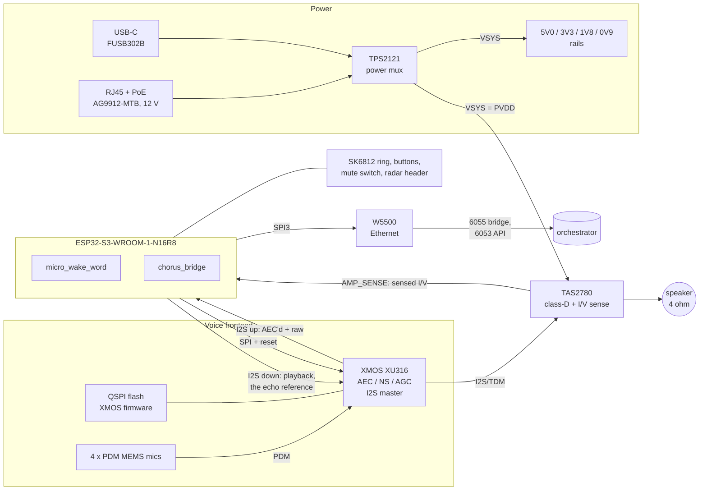
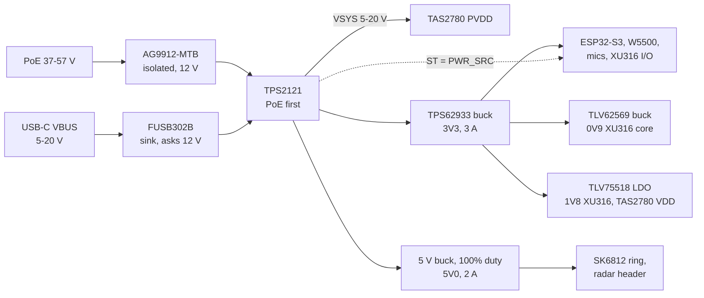

# The Chorus satellite board

A satellite PCB designed around what Chorus asks of a device, rather than
around what Home Assistant's Assist asks of one. This is rev A: a design with a
machine-checked pin map, not a fabricated board. Nothing here has been on a
bench yet, and [what is still open](#open-questions) says exactly which claims
wait on one.

The decision and its alternatives are [ADR-0047](../adr/0047-the-satellite-board-keeps-the-reference-voice-frontend-and-adds-a-wire.md).
The pin map, which the schematic's net labels and the board's ESPHome config
both come from, is [`hardware/chorus-sat/pins.yaml`](../../hardware/chorus-sat/pins.yaml);
[`internal/board`](../../internal/board/board.go) checks it on every
`task test`.

## What Chorus asks of the hardware

Every choice below traces to one of these. A part that serves none of them is
not on the board.

| Chorus property | What the board must do | How rev A does it |
|---|---|---|
| The mic never stops, even during playback (SPEC §3.1) | Cancel the satellite's own voice in hardware, against a reference that is sample-exact with what plays | XMOS XU316 runs AEC; playback passes through it, so its reference is the signal itself |
| Barge-in truncates at the byte actually played (SPEC §3.2.1, ADR-0033) | One clock from the amplifier back to the ESP32's frame counter, and a fixed, measurable delay after it | The XU316 masters every audio clock; the amplifier's sense output returns to the ESP32 on `AMP_SENSE` |
| Per-utterance speaker embeddings; the conversation follows the person (SPEC §4.5, §5) | A voiceprint enrolled at one satellite matches at every other, so every satellite hears the same way | Same XU316, mic layout and XMOS firmware as the Satellite1: an acoustic peer, not a new frontend |
| Duplex needs airtime, not bandwidth (SPEC §3.3.2) | A path that does not share 2.4 GHz with the household | W5500 Ethernet with 802.3af PoE; Wi-Fi stays as the other build |
| Hardware mute is authoritative (CONTRIBUTING §7) | A switch firmware cannot override, and a state the device can still report | The switch cuts mic power and clock directly; the ESP32 only reads `MUTE_SENSE` |
| Not a media player (SPEC §1) | An amplifier sized for speech, not music | TAS2780 on a 12 V rail from PoE: full power without a 20 V USB-PD contract |
| A bad flash is recoverable without a teardown | Flashing and logs on a cable, a forced download mode | Native USB-C to the ESP32, `BTN_ACTION` on the BOOT strap |

## Block diagram

Two buses carry everything that matters. The I2S bus, mastered by the XU316,
carries the mics up and the voice down; the amplifier hangs off the same
clocks. The Ethernet chip gets the ESP32's other SPI host, so a slow network
transaction never sits on the bus the XMOS needs to answer before any audio
flows (SPEC §3.3.2).

## Component choices

Each of these is a default picked where the ask forked. The alternatives that
lost are in [ADR-0047](../adr/0047-the-satellite-board-keeps-the-reference-voice-frontend-and-adds-a-wire.md).

### ESP32-S3-WROOM-1-N16R8

The SoC both reference satellites use, with the same 16 MB flash and 8 MB
octal PSRAM. That is the point: `chorus_bridge`, `micro_wake_word`, the
duplex I2S driver and FutureProofHomes' `satellite1`, `tas2780` and `fusb302b`
components all run on it today in [`esphome/satellite1.yaml`](../../esphome/satellite1.yaml).
Porting the firmware is a pin change, and the pin map makes most of it no
change at all: every XMOS-facing pin sits where Satellite1 has it, and a test
fails the build if one moves.

Octal PSRAM costs GPIO33–37; the native USB pins (19, 20) stay for flashing
and logs, and GPIO45, which picks the flash supply voltage, carries nothing.
`internal/board` refuses all of them.

### XMOS XU316, with Satellite1's XMOS firmware

The XU316 (`XU316-1024-QF60B`, 3.3 V I/O) does AEC, noise suppression and AGC
and hands the ESP32 two channels: the echo-cancelled mix and a raw mic. That
is the shape the wire protocol already carries (`0x02 mic`, `flags` 0 and 1)
and the shape [SPEC §9.3](../SPEC.md#93-two-stage-wake-confirmation-phase-1)
wants for the wake-word corpus.

Keeping the Satellite1's frontend matters more than any spec sheet. Speaker
identification compares each utterance against centroids enrolled once
(SPEC §5); a satellite with a different frontend hears the same person
differently and makes the conversation that follows them across rooms less
sure who they are. A household mixing these boards with Satellite1s and Voice
PEs keeps one acoustic tier, which SPEC §3.3 records as the current state.

Its rails are 0.9 V core (0.855–0.945 V), 3.3 V I/O on the QF60B, and 1.8 V
for the `VDDIOB18` pins; the PLL's 0.9 V is filtered off the core rail.

### Microphones: four PDM MEMS positions

Four mic footprints in the Satellite1's positions, populated with its part.
The Satellite1's XMOS firmware uses two today; the other two cost little and
are what a later firmware, or a move to an XVF3800-class beamformer with
direction of arrival, needs without a new enclosure.

Positions are not a free choice: the XMOS pipeline is tuned to the reference
geometry, so rev A copies it rather than improving it.

### TAS2780 amplifier, on a 12 V rail

The Satellite1's amplifier, with a driver Chorus already builds against. Two
properties earn it the slot here:

- **PVDD 3–24 V.** On PoE the board makes 12 V directly, which is
  comfortably inside the amplifier's full-power mode (the Satellite1 config
  takes that mode at 9 V or more). On a plain 5 V USB-C supply it runs its
  low-power mode, as the Satellite1 does below a 9 V contract.
- **I/V sense on SDOUT.** The amplifier reports the current and voltage it
  actually drives into the speaker. Routed to the XU316, it is an echo
  reference that includes amplifier and driver behaviour; routed to the ESP32
  (`AMP_SENSE`, on its second I2S peripheral and the same clocks), it is the
  ground truth for the truncation point. See below.

A voice satellite is not a media player (SPEC §1), so the speaker is a 40–50 mm
full-range 4 Ω driver in a sealed chamber, chosen for intelligibility at
conversational level, not bass.

### Ethernet: W5500 and 802.3af PoE

SPEC §3.3.2 measured the limit that firmware cannot fix: uplink and downlink
share one 2.4 GHz radio, short audio frames spend airtime on headers, and on
a congested evening plain ICMP loses 8.3% of packets while duplex audio runs,
at a strong −49 dBm. A cable removes the question. The W5500 is ESPHome's supported
SPI Ethernet chip on the S3, and 512 kbps of duplex PCM is nothing to it.

The PoE side is a Silvertel AG9912-MTB: 802.3af in, 12 V and 12 W out at 70 °C
(9 W at 85 °C). One cable powers and connects a ceiling or wall satellite.

ESPHome cannot run `ethernet:` and `wifi:` in one firmware, so this is one
board and two builds: the Ethernet build for PoE installs, the Wi-Fi build for
a satellite on a shelf by a USB-C charger. The W5500 is simply idle in the
second.

### Power

The TPS2121 prefers PoE and reports which input won on `PWR_SRC`, which
replaces the Satellite1's "wait for the PD contract, then pick an amplifier
mode" with a pin read. USB-C still negotiates through the FUSB302B, on the
pins the Satellite1 uses, so the existing `fusb302b` component works when the
board runs from a charger.

Rough budget on PoE, from datasheet typicals and to be measured at bring-up:

| Load | Rail | Estimate |
|---|---|---|
| ESP32-S3, radio off in the Ethernet build | 3V3 | 0.3 W |
| W5500 at 100 Mbit | 3V3 | 0.45 W |
| XU316 running the voice pipeline | 0V9 / 1V8 / 3V3 | 0.5 W |
| 12 x SK6812, capped at 25% in firmware | 5V0 | 0.9 W |
| TAS2780, speech peaks into 4 Ω | VSYS | 3–5 W |
| HLK-LD2450 radar, when fitted | 5V0 | 0.6 W |
| Conversion losses | | 1 W |
| **Total** | | **7–9 W of 12 W** |

### Mute, LEDs, buttons, presence

- **Mute** is a slide switch, not a button with firmware behind it. It opens
  the mics' load switch (TPS22917) and gates the PDM clock with a single AND
  gate, lights a red LED through a transistor on the switch net, and is read
  by the ESP32 on `MUTE_SENSE` so the device can send `0x05 mute` with the
  hardware bit set. No GPIO can unmute it.
- **LED ring**: 12 SK6812-mini on the 5V0 rail, driven from `LED_DATA`
  through a 74AHCT1G125 so 3.3 V logic meets the LEDs' 5 V input threshold.
  From a 5 V USB-C supply the 5V0 buck runs in dropout and the ring sees a
  little under 5 V, inside the SK6812's range. The ring is how a person sees Chorus
  speaking *and* working at once.
- **Buttons**: action on GPIO0 (also the BOOT strap; held at power-on it
  enters download mode), volume up and down.
- **Presence**: a 4-pin header for an HLK-LD2450 on `RADAR_TX`/`RADAR_RX`.
  The Satellite1's radar turned out useful for presence-gated sessions, and
  it is a cheap input to deciding which satellite a moving person is at.

## The truncation point, in hardware

The playback position Chorus journals is `frames / sample_rate` from the
speaker's `add_audio_output_callback`: frames the ESP32's I2S peripheral
clocked out (SPEC §3.2.1). On this board those frames go to the XU316, which
passes them to the amplifier after a fixed pipeline delay. The position is
exact in frames and early by a constant.

Rev A makes that constant a measurement instead of a datasheet line:

1. Every audio clock on the board comes from the XU316. The ESP32 counts
   frames of the same clock the amplifier plays, so the counter cannot drift
   from the speaker over a long answer.
2. `AMP_SENSE` carries the TAS2780's sensed speaker current back to the ESP32
   on those same clocks. Cross-correlating it with the PCM that went out gives
   the board's real end-to-end delay, per board, in samples.
3. A test point on `AMP_SENSE`, `I2S_DOUT` and `I2S_LRCLK` lets a logic
   analyser confirm the same number without firmware.

What firmware does with it is a later decision with its own ADR: a calibrated
offset in the `played` report, or a third uplink channel so the host can
verify truncation itself. The board only has to make either possible.

## Schematic architecture

A hierarchical KiCad schematic, one sheet per block. Net labels on every sheet
are the `net` names in [`pins.yaml`](../../hardware/chorus-sat/pins.yaml); a
net not in the map does not touch the ESP32.

| Sheet | Contents | Nets out |
|---|---|---|
| `power_in` | RJ45 magjack with PoE centre taps, input bridges, AG9912-MTB, USB-C receptacle, FUSB302B, TPS2121, TVS on both inputs | `VSYS`, `PWR_SRC`, `PD_INT_N`, `I2C_*` |
| `regulators` | TPS62933 3V3, 5V0 buck, TLV62569 0V9, TLV75518 1V8, PLL filter for the XU316 | `3V3`, `5V0`, `1V8`, `0V9`, `0V9_PLL` |
| `mcu` | ESP32-S3-WROOM-1-N16R8, USB D+/D− to the receptacle, EN RC and reset button, action and volume buttons | every net in the pin map |
| `voice_dsp` | XU316-1024-QF60B, 24 MHz crystal, QSPI flash, decoupling per the XMOS datasheet, xTAG debug header | `I2S_*`, `XMOS_*`, `PDM_CLK`, `PDM_DATA_*`, `AMP_TDM_*` |
| `mics` | Four PDM MEMS mics, TPS22917 load switch, PDM clock gate, mute switch and its LED | `MUTE_SENSE`, `PDM_*` |
| `amp` | TAS2780, PVDD bulk and decoupling, output ferrites and caps, speaker connector, sense taps at the connector | `AMP_SENSE`, `AMP_TDM_*`, `I2C_*` |
| `ethernet` | W5500, 25 MHz crystal, magjack data pairs (shared footprint with `power_in`) | `ETH_*` |
| `ui` | SK6812 ring, 74AHCT1G125, radar header, test points | `LED_DATA`, `RADAR_*` |

## Layout

- **Four layers**: signal, solid ground, power, signal. The ground plane is
  unbroken under the I2S, PDM and Wi-Fi antenna areas.
- **Round, about 90 mm**, mics and LEDs on the top face, speaker firing from
  the bottom into its own sealed chamber. Mic-to-speaker distance and the
  gasket between them do more for AEC than any firmware setting.
- **Mic ports** gasketed to the enclosure, positions copied from the
  Satellite1 layout.
- **Class-D output** kept short and away from the mics and the PDM lines;
  ferrites and caps per the TAS2780 EMI guidance, sense taps after them and
  at the speaker connector so the sense measures what the speaker receives.
- **I2S and PDM**: series resistors at each source, routed over ground, no
  layer change where avoidable.
- **The ESP32 antenna** at the board edge with Espressif's keep-out, even in
  the Ethernet build, so the Wi-Fi build is the same board.
- **PoE isolation**: the clearance and creepage the AG9912 datasheet
  specifies between the cable side and everything else.

## From here to a built board

1. **Copy the frontend, do not redesign it.** Take the XU316 sheet, QSPI
   flash, mic part and mic positions from FutureProofHomes'
   `Satellite1-Hardware` sources, and the XU316 port assignments from the
   XMOS firmware's board definition.
2. **Capture the schematic** in KiCad 9 under `hardware/chorus-sat/`, sheets
   as above, labels from `pins.yaml`. Espressif publishes a KiCad library
   with the module; the XU316, TAS2780 and W5500 come from their vendors'
   symbols.
3. **Check the schematic against the map in CI.** `kicad-cli sch export
   netlist` gives which ESP32 pad each label lands on; a test beside
   `internal/board` comparing that to `pins.yaml` keeps the two from
   drifting, exactly as `Mirrors` keeps the map honest against Satellite1.
4. **Lay out, then order a small batch** (five boards) of four-layer with
   assembly. Check every BOM line against the assembler's stock before
   layout, not after; the PoE module may need hand placement.
5. **Bring up in order**, each step with the check that proves it:
   - rails, with no modules powered past them;
   - ESP32 alone, flashed over USB-C;
   - the XU316 answers over SPI (the Satellite1 config's status log);
   - I2S clocks present; mic frames arrive while idle;
   - the amplifier plays, and `AMP_SENSE` shows the speaker current;
   - Ethernet up, then `task test:hardware` over the cable, compared with the
     Wi-Fi numbers in SPEC §3.3.2;
   - the end-to-end delay from `AMP_SENSE`, recorded per board.
6. **Firmware**: `esphome/chorus-sat.yaml` is `satellite1.yaml` with an
   `ethernet:` block in place of `wifi:`, a `PWR_SRC` read in place of the PD
   contract logic, and the LED ring, buttons and mute sensor added.

## Open questions

What rev A cannot settle without the reference sources or a bench:

- **XMOS firmware licensing.** Whether FutureProofHomes' XU316 firmware may
  run on a third-party board. If it may not, the fallback is the Voice PE's
  XMOS firmware, whose ESP32 interface differs and whose pins would move.
- **Mic geometry and part**, and the XU316 port map: read from the Satellite1
  sources, not inferred.
- **`I2S_MCLK` direction.** The Satellite1 config names the pin but not who
  drives it; the reference schematic does.
- **Two I2S peripherals on shared clock pads.** `AMP_SENSE` assumes the
  ESP32's second I2S peripheral can take the same BCLK and LRCLK pads as the
  first through the GPIO matrix. Expected to work; prove it at bring-up.
- **The TAS2780 sense slots**, and whether the Satellite1's XMOS firmware
  already uses them as its echo reference.
- **Muted PDM lines.** With the mics' clock gated their data lines float;
  pull-downs plus the XMOS pipeline's DC blocking should settle to silence,
  and the bridge's mute frame tells the host either way.
- **The PoE magjack**: a part with centre taps exposed, chosen against the
  assembler's stock.
