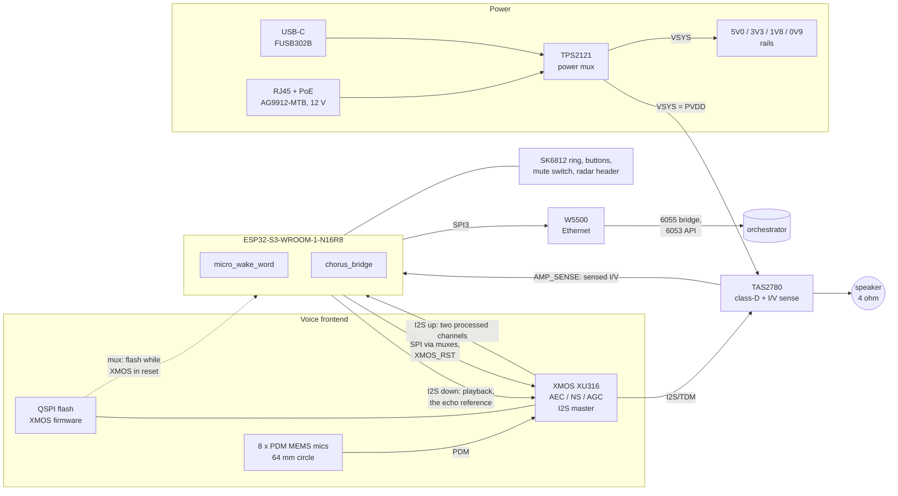
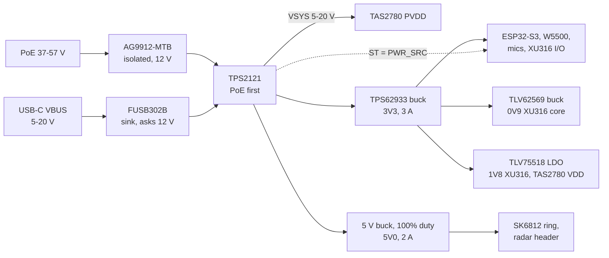

# The Chorus satellite board

A satellite PCB designed around what Chorus asks of a device, rather than
around what Home Assistant's Assist asks of one. This is rev A: a design with a
machine-checked pin map, not a fabricated board. Nothing here has been on a
bench yet, and [what is still open](#open-questions) says exactly which claims
wait on one.

The decision and its alternatives are [ADR-0047](../adr/0047-the-satellite-board-keeps-the-reference-voice-frontend-and-adds-a-wire.md).
The pin map, which the schematic's net labels and the board's ESPHome config
both come from, is [`hardware/chorus-sat/pins.yaml`](../../hardware/chorus-sat/pins.yaml);
[`internal/board`](../../internal/board/board.go) checks it on every
`task test`.

## What Chorus asks of the hardware

Every choice below traces to one of these. A part that serves none of them is
not on the board.

| Chorus property | What the board must do | How rev A does it |
|---|---|---|
| The mic never stops, even during playback (SPEC §3.1) | Cancel the satellite's own voice in hardware, against a reference that is sample-exact with what plays | XMOS XU316 runs AEC; playback passes through it, so its reference is the signal itself |
| Barge-in truncates at the byte actually played (SPEC §3.2.1, ADR-0033) | One clock from the amplifier back to the ESP32's frame counter, and a fixed, measurable delay after it | The XU316 masters every audio clock; the amplifier's sense output returns to the ESP32 on `AMP_SENSE` |
| Per-utterance speaker embeddings; the conversation follows the person (SPEC §4.5, §5) | A voiceprint enrolled at one satellite matches at every other, so every satellite hears the same way | Same XU316, mic part, cross and XMOS firmware as the Satellite1: an acoustic peer, not a new frontend |
| Knows who said what, and the barge-in gate rejects the TV (SPEC §4.3, §5) | Tell where in the room a voice is | Eight mics on a 64 mm circle, wired for direction of arrival; the estimator is firmware work |
| Duplex needs airtime, not bandwidth (SPEC §3.3.2) | A path that does not share 2.4 GHz with the household | W5500 Ethernet with 802.3af PoE; Wi-Fi stays as the other build |
| Hardware mute is authoritative (CONTRIBUTING §7) | A switch firmware cannot override, and a state the device can still report | The switch cuts mic power and clock directly; the ESP32 only reads `MUTE_SENSE` |
| Not a media player (SPEC §1) | An amplifier sized for speech, not music | TAS2780 on a 12 V rail from PoE: full power without a 20 V USB-PD contract |
| A bad flash is recoverable without a teardown | Flashing and logs on a cable, a forced download mode | Native USB-C to the ESP32, `BTN_ACTION` on the BOOT strap |

## Block diagram

Two buses carry everything that matters. The I2S bus, mastered by the XU316,
carries the mics up and the voice down; the amplifier hangs off the same
clocks. The Ethernet chip gets the ESP32's other SPI host, so a slow network
transaction never sits on the bus the XMOS needs to answer before any audio
flows (SPEC §3.3.2).

## Component choices

Each of these is a default picked where the ask forked. The alternatives that
lost are in [ADR-0047](../adr/0047-the-satellite-board-keeps-the-reference-voice-frontend-and-adds-a-wire.md).

### ESP32-S3-WROOM-1-N16R8

The SoC both reference satellites use, with the same 16 MB flash and 8 MB
octal PSRAM. That is the point: `chorus_bridge`, `micro_wake_word`, the
duplex I2S driver and FutureProofHomes' `satellite1`, `tas2780` and `fusb302b`
components all run on it today in [`esphome/satellite1.yaml`](../../esphome/satellite1.yaml).
Porting the firmware is a pin change, and the pin map makes most of it no
change at all: every XMOS-facing pin sits where Satellite1 has it, and a test
fails the build if one moves.

Octal PSRAM costs GPIO33–37 and GPIO45, which picks the flash supply voltage,
carries nothing; `internal/board` refuses all of them. The native USB pins
(19, 20) carry `USB_DN` and `USB_DP` to the USB-C receptacle for flashing and
logs, and the check refuses any other net there.

### XMOS XU316, with Satellite1's XMOS firmware

The XU316 (`XU316-1024-QF60B`, 3.3 V I/O) runs FutureProofHomes' XMOS
firmware unmodified and hands the ESP32 two channels at 48 kHz, each 16 kHz
sample repeated three times. **Both are processed**: slot 0 is AEC, interference
cancelling, noise suppression and AGC; slot 1 is the same without AGC
(`src/main.c`, `app_conf.h` in Satellite1-XMOS). Neither is a raw mic
([SPEC §3.2](../SPEC.md#32-component-contract)). A raw channel needs an XMOS
firmware change, which its licence permits as a derivative; the Voice PE's
firmware has a control message for it that a derivative could copy.

The firmware is under the XMOS Public Licence v1. Its only device condition
is that it runs on XMOS silicon, which a genuine XU316 meets; distributing
the board would mean keeping XMOS's notices and publishing any modified
firmware's source. The Satellite1 schematic this frontend is drawn from is
CERN-OHL-S-2.0, published as PDF only: the frontend is redrawn from it, and a
board shared or sold beyond this household publishes its full source under
the same licence. The board's name stays Chorus's own, never Satellite1's or
FutureProofHomes'.

Keeping the Satellite1's frontend matters more than any spec sheet. Speaker
identification compares each utterance against centroids enrolled once
(SPEC §5); a satellite with a different frontend hears the same person
differently and makes the conversation that follows them across rooms less
sure who they are. A household mixing these boards with Satellite1s and Voice
PEs keeps one acoustic tier, which SPEC §3.3 records as the current state.

Its rails are 0.9 V core (0.855–0.945 V), 3.3 V I/O on the QF60B, and 1.8 V
for the `VDDIOB18` pins; the PLL's 0.9 V is filtered off the core rail.
`RST_N` pulls up to 1.8 V on the Satellite1, so reset and JTAG sit on the 1.8 V
domain.

Two parts of the Satellite1's XMOS sheet are not optional, and rev A's first
draft missed both:

- **Reset is active high from the ESP32.** GPIO4 drives the gate of an N-FET
  (FDV301N) that pulls `RST_N` low, and the `satellite1` component writes 1
  then 0 to reset. Wired straight to `RST_N`, the XMOS never leaves reset. The
  net is `XMOS_RST`.
- **The ESP32's SPI reaches the XMOS through two 2:1 muxes** switched by
  `XMOS_RST`. While the XMOS runs, the ESP32 talks to its SPI slave; while
  it is held in reset, the ESP32 reaches its QSPI flash directly, which is how
  `memory_flasher` writes the XMOS firmware. Without them the XMOS cannot be
  flashed from the ESP32.

The XU316's connections, from the firmware's `SATELLITE1.xn` and
`platform_init.c`, which agree with the rev 6.1 schematic:

| XU316 pin | Signal | Other end |
|---|---|---|
| X1D10 | I2S BCLK, 3.072 MHz, XU316 master | `I2S_BCLK`, TAS2780 SBCLK |
| X1D01 | I2S LRCLK, 48 kHz | `I2S_LRCLK`, TAS2780 FSYNC |
| X1D11 | MCLK, 24.576 MHz from the App PLL | `I2S_MCLK` through an unfitted 0 Ω |
| X1D34 | I2S out: the two processed channels | `I2S_DIN` |
| X1D13 | I2S in: playback, also the echo reference | `I2S_DOUT` |
| X1D00 | I2S out: playback passthrough | TAS2780 SDIN |
| X1D22 | PDM clock, 3.072 MHz, 100 Ω series | all eight mics, through the mute gate |
| X1D16, X1D17 | PDM data 1, data 2 | MK3 + MK4, MK1 + MK2 |
| X1D18, X1D19 | PDM data 3, data 4; test points on the Satellite1 | MK5 + MK6, MK7 + MK8 |
| X0D01, X0D10, X0D04–07 | QSPI boot flash CS, CLK, D0–3 | W25Q64JVSSIQ, 3.3 V, and the muxes |
| X0D00, X0D35, X0D36, X0D39 | SPI slave CS, CLK, MISO, MOSI, mode 3 | the muxes, then `XMOS_SPI_*` |
| X0D32 | IRQ input | TAS2780 IRQZ |
| `RST_N` | reset, 10 kΩ to 1.8 V | the N-FET on `XMOS_RST` |

The sheet also carries a 24 MHz crystal and a TC2030 JTAG footprint. The
Satellite1 drives its LED ring from both the XMOS (X1D09) and ESP32 GPIO21,
and sends the passthrough to ESP32 GPIO40; rev A uses those GPIOs for the
W5500 and copies neither net.

### Microphones: eight PDM MEMS on a circle, for direction of arrival

Eight CUI CMM-4030DT-261280-TR PDM mics, two per data line, evenly spaced on
a circle about 64.2 mm across, all on the top side. Four of them are the
Satellite1's cross, at the positions its rev 6.1 STEP model gives, so the
stock XMOS firmware hears exactly what it hears there. The other four sit
between them, on the two PDM data lines the Satellite1 leaves as test points.

| Mic | Position (mm, y down) | SEL | Data line | Port bit |
|---|---|---|---|---|
| MK1 | (0, −32.08) | GND | data 2 | X1D17 |
| MK2 | (+32.08, 0) | VDD | data 2 | X1D17 |
| MK3 | (0, +32.08) | GND | data 1 | X1D16 |
| MK4 | (−32.08, 0) | VDD | data 1 | X1D16 |
| MK5 | (+22.68, −22.68) | GND | data 3 | X1D18 |
| MK6 | (+22.68, +22.68) | VDD | data 3 | X1D18 |
| MK7 | (−22.68, +22.68) | GND | data 4 | X1D19 |
| MK8 | (−22.68, −22.68) | VDD | data 4 | X1D19 |

MK1–MK4 keep the Satellite1's SEL straps exactly, so the firmware's mapping
(`MIC_COUNT=2`, slots 4 and 5, an opposite pair) still picks the same
physical mics. All eight share the one PDM clock and the mute gate.

**Why eight, not the Satellite1's four.** Direction of arrival answers "where
in the room is this voice", which helps the barge-in gate (SPEC §4.3) tell a
person from the TV and helps attribution when a second person chimes in
(SPEC §5). Its resolution is set by spacing. A pair resolves direction
without ambiguity up to `c / 2d`: the cross's adjacent mics, 45.4 mm apart,
alias above about 3.8 kHz, well inside speech. The circle's adjacent mics are
24.6 mm apart and alias above about 7 kHz, close to the 8 kHz top of a
16 kHz pipeline, while opposite mics keep the 64.2 mm aperture for low
frequencies. Eight mics cost a few dollars and no new parts; four more
footprints later would mean a new board.

**What DoA needs beyond the board.** The stock firmware reads two mics and
reports no direction, so the hardware is ready before the firmware is:

- **On the XU316.** A derivative of the XMOS firmware, which its licence
  permits, raises the mic count to eight on port 4D and runs a direction
  estimator (GCC-PHAT or SRP-PHAT over the eight channels) beside the
  existing pipeline. Whether the XU316 has the cycles for both is the first
  thing to measure; AEC already runs on two tiles.
- **Or on the host.** The XU316 sends raw channels over a wider I2S frame and
  `chorus_bridge` forwards them; the orchestrator estimates direction where
  the journal can record and replay it. Eight 16 kHz channels are about
  2 Mbit/s: easy over Ethernet, not over the Wi-Fi SPEC §3.3.2 measured.
- **Either way it is a wire change.** Direction arrives as a new frame or new
  channels, which is a protocol version and its own ADR, as `played` was
  (ADR-0033).

An XVF3800, which does four-mic beamforming and DoA out of the box, stays the
alternative if the XU316 cannot carry it: it is a different frontend, so
voiceprints would need re-enrolling (ADR-0047).

Positions of MK1–MK4 are not a free choice: the stock pipeline is tuned to
that geometry, so rev A copies it and adds to it rather than moving it.

### TAS2780 amplifier, on a 12 V rail

The Satellite1's amplifier, with a driver Chorus already builds against. Two
properties earn it the slot here:

- **PVDD 3–24 V.** On PoE the board makes 12 V directly, which is
  comfortably inside the amplifier's full-power mode (the Satellite1 config
  takes that mode at 9 V or more). On a plain 5 V USB-C supply it runs its
  low-power mode, as the Satellite1 does below a 9 V contract.
- **I/V sense on SDOUT.** The amplifier reports the current and voltage it
  actually drives into the speaker. Routed to the ESP32 (`AMP_SENSE`, on its
  second I2S peripheral and the same clocks), it is the ground truth for the
  truncation point. See below. This is new: the Satellite1 leaves SDOUT
  unconnected, its echo reference is the ESP32's digital playback inside the
  XMOS, and the `tas2780` driver does not configure the sense slots.

A voice satellite is not a media player (SPEC §1), so the speaker is a 40–50 mm
full-range 4 Ω driver in a sealed chamber, chosen for intelligibility at
conversational level, not bass.

### Ethernet: W5500 and 802.3af PoE

SPEC §3.3.2 measured the limit that firmware cannot fix: uplink and downlink
share one 2.4 GHz radio, short audio frames spend airtime on headers, and on
a congested evening plain ICMP loses 8.3% of packets while duplex audio runs,
at a strong −49 dBm. A cable removes the question. The W5500 is ESPHome's supported
SPI Ethernet chip on the S3, and 512 kbps of duplex PCM is nothing to it.

The PoE side is a Silvertel AG9912-MTB: 802.3af in, 12 V and 12 W out at 70 °C
(9 W at 85 °C). One cable powers and connects a ceiling or wall satellite.

ESPHome cannot run `ethernet:` and `wifi:` in one firmware, so this is one
board and two builds: the Ethernet build for PoE installs, the Wi-Fi build for
a satellite on a shelf by a USB-C charger. The W5500 is simply idle in the
second.

### Power

The Satellite1 runs the amplifier's PVDD straight from USB VBUS; VSYS does
the same job here, from whichever input is live.

The TPS2121 prefers PoE and reports which input won on `PWR_SRC`, which
replaces the Satellite1's "wait for the PD contract, then pick an amplifier
mode" with a pin read. USB-C still negotiates through the FUSB302B, on the
pins the Satellite1 uses, so the existing `fusb302b` component works when the
board runs from a charger.

Rough budget on PoE, from datasheet typicals and to be measured at bring-up:

| Load | Rail | Estimate |
|---|---|---|
| ESP32-S3, radio off in the Ethernet build | 3V3 | 0.3 W |
| W5500 at 100 Mbit | 3V3 | 0.45 W |
| XU316 running the voice pipeline | 0V9 / 1V8 / 3V3 | 0.5 W |
| 12 x SK6812, capped at 25% in firmware | 5V0 | 0.9 W |
| TAS2780, speech peaks into 4 Ω | VSYS | 3–5 W |
| HLK-LD2450 radar, when fitted | 5V0 | 0.6 W |
| Conversion losses | | 1 W |
| **Total** | | **7–9 W of 12 W** |

### Mute, LEDs, buttons, presence

- **Mute** is a slide switch, not a button with firmware behind it. It opens
  the mics' load switch (TPS22917), as the Satellite1's latch cuts `VDD_MIC`,
  and also gates the PDM clock with a single AND gate, which the Satellite1
  does not, lights a red LED straight off the switch net, and is read
  by the ESP32 on `MUTE_SENSE` so the device can send `0x05 mute` with the
  hardware bit set. No GPIO can unmute it.
- **LED ring**: 12 SK6812-mini on the 5V0 rail, driven from `LED_DATA`
  through a 74AHCT1G125 so 3.3 V logic meets the LEDs' 5 V input threshold.
  From a 5 V USB-C supply the 5V0 buck runs in dropout and the ring sees a
  little under 5 V, inside the SK6812's range. The ring is how a person sees Chorus
  speaking *and* working at once.
- **Buttons**: action on GPIO0 (also the BOOT strap; held at power-on it
  enters download mode), volume up and down.
- **Presence**: a 4-pin header for an HLK-LD2450 on `RADAR_TX`/`RADAR_RX`.
  The Satellite1's radar turned out useful for presence-gated sessions, and
  it is a cheap input to deciding which satellite a moving person is at.

## The truncation point, in hardware

The playback position Chorus journals is `frames / sample_rate` from the
speaker's `add_audio_output_callback`: frames the ESP32's I2S peripheral
clocked out (SPEC §3.2.1). On this board those frames go to the XU316, which
passes them to the amplifier after a fixed pipeline delay. The position is
exact in frames and early by a constant.

Rev A makes that constant a measurement instead of a datasheet line:

1. Every audio clock on the board comes from the XU316. The ESP32 counts
   frames of the same clock the amplifier plays, so the counter cannot drift
   from the speaker over a long answer.
2. `AMP_SENSE` carries the TAS2780's sensed speaker current back to the ESP32
   on those same clocks. Cross-correlating it with the PCM that went out gives
   the board's real end-to-end delay, per board, in samples. Nothing upstream
   does this, so it is new work in the `tas2780` driver and in firmware.
3. A test point on `AMP_SENSE`, `I2S_DOUT` and `I2S_LRCLK` lets a logic
   analyser confirm the same number without firmware.

What firmware does with it is a later decision with its own ADR: a calibrated
offset in the `played` report, or a third uplink channel so the host can
verify truncation itself. The board only has to make either possible.

## Schematic architecture

The schematic is data: [`parts.yaml`](../../hardware/chorus-sat/parts.yaml)
lists every part with each pad's name and electrical type, and one file per
sheet under [`sheets/`](../../hardware/chorus-sat/sheets/) places parts and
names nets. Net labels are global across sheets, and the ESP32's are the `net`
names in [`pins.yaml`](../../hardware/chorus-sat/pins.yaml); a net not in the
map does not touch the ESP32. `internal/board` checks it the way KiCad's ERC
would (every pad on a net or marked unconnected, no net with one end, one
driver per net, every rail supplied, every module pad where the pin map says)
and `task gen:hardware` writes the KiCad netlist and the JLCPCB BOM from it.
There is no KiCad in CI, and YAML diffs read in review where a `.kicad_sch`
does not.

| Sheet | Contents | Nets out |
|---|---|---|
| `power_in` | Bridges on the magjack's PoE taps, SMAJ58A, AG9912-MTB, USB-C receptacle with ESD and SMAJ24A, FUSB302B, TPS2121 | `VSYS`, `PWR_SRC`, `I2C_*`, `USB_D*` |
| `regulators` | TPS62933 3V3 and 5V0 bucks, TLV62569 0V9, two TLV75518 for 1V8 and the amplifier's 1V8A | `3V3`, `5V0`, `0V9`, `1V8`, `1V8A` |
| `mcu` | ESP32-S3-WROOM-1-N16R8, EN RC and reset button, action and volume buttons | every net in the pin map |
| `voice_dsp` | XU316-1024-QF60B, 24 MHz crystal, W25Q64JVSSIQ QSPI flash, the two BL1530 SPI muxes, the FDV301N reset inverter, unfitted 0 Ω on MCLK, PLL ferrite, decoupling, unfitted TC2030 JTAG | `I2S_*`, `XMOS_*`, `PDM_CLK_X`, `PDM_DATA_*`, `AMP_SDIN`, `I2C_*` |
| `mics` | Eight CMM-4030DT PDM mics with the SEL straps above, TPS22917 load switch, PDM clock gate, mute switch and its LED | `MUTE_SENSE`, `MIC_MUTED`, `PDM_*` |
| `amp` | TAS2780, filterless as on the Satellite1, PVDD bulk, sense taps at the speaker connector | `AMP_SENSE`, `AMP_SDIN`, `I2S_*`, `I2C_*` |
| `ethernet` | W5500 after WIZnet's reference, 25 MHz crystal, the LPJG0926HENL magjack | `ETH_*`, `POE_VC*` |
| `ui` | SK6812 ring, 74AHCT1G125, radar header, unfitted test points | `LED_DIN`, `RADAR_*` |

`I2C_IRQ` is one open-drain line shared by the FUSB302B, the TAS2780 and the
XU316's X0D32, as on the Satellite1; it replaces the earlier `PD_INT_N`.

### Ordering from JLCPCB

Every part carries its LCSC number, or for jellybean resistors and capacitors a
per-value number, or a `hand:` line saying why JLCPCB will not place it (the
pin header, the TC2030 pads and test points). `bom.csv` is in the columns
JLCPCB's assembly upload reads (Comment, Designator, Footprint, LCSC Part #),
and unfitted parts (`dnp: true`) stay on the netlist for layout but off it. A
value with an empty number is one JLCPCB matches by value and footprint at
upload.

The path to an order:

1. In KiCad 9.0.5 or later (9.0.0 lacks the mute switch's and the bucks'
   inductor footprints), *File → Import → Netlist* the generated `chorus-sat.net` into
   a new `chorus-sat.kicad_pcb`. Footprints and nets arrive; placement and
   routing are a person's work.
2. Copy `hardware/chorus-sat/fp-lib-table` and `chorus-sat.pretty` beside
   the new board, or open it from that folder: the footprints KiCad's library
   lacks are there, each checked pad for pad against `parts.yaml` by
   `go test ./internal/board` (sources in its README). The TAS2780's is the
   one exception: its licence does not allow republishing it, so download it
   first as that README says.
3. Lay out per the next section. Changes to parts or nets go in the YAML and
   come back through *Update PCB from netlist*.
4. Plot Gerbers and drill files, and the position file (the CPL), from
   Pcbnew. EasyEDA Pro imports a KiCad project too, for those who would rather
   route there; it keeps the LCSC field.
5. Upload Gerbers, `bom.csv` and the CPL to JLCPCB as a four-layer board with
   assembly, and check each rotation in its preview.

Stock to check before layout, not after:

| Part | LCSC | Risk |
|---|---|---|
| AG9912-MTB | C20939164 | none in stock at capture; may need hand placement or a different PoE module |
| CMM-4030DT | C37002688 | 25 in stock, eight per board |
| XU316-1024-QF60B-C32 | C7397517 | 12 in stock |
| BL1530TQFN | C313543 | stock unknown |

| Sheet | Contents | Nets out |
|---|---|---|
| `power_in` | RJ45 magjack with PoE centre taps, input bridges, AG9912-MTB, USB-C receptacle, FUSB302B, TPS2121, TVS on both inputs | `VSYS`, `PWR_SRC`, `I2C_IRQ`, `I2C_*` |
| `regulators` | TPS62933 3V3, 5V0 buck, TLV62569 0V9, TLV75518 1V8, PLL filter for the XU316 | `3V3`, `5V0`, `1V8`, `0V9`, `0V9_PLL` |
| `mcu` | ESP32-S3-WROOM-1-N16R8, USB D+/D− to the receptacle, EN RC and reset button, action and volume buttons | every net in the pin map |
| `voice_dsp` | XU316-1024-QF60B, 24 MHz crystal, W25Q64JVSSIQ QSPI flash, the two 2:1 SPI muxes, the FDV301N reset inverter, unfitted 0 Ω on MCLK, decoupling per the XMOS datasheet, TC2030 JTAG | `I2S_*`, `XMOS_*`, `PDM_CLK`, `PDM_DATA_*`, `AMP_TDM_*` |
| `mics` | Eight CMM-4030DT PDM mics with the SEL straps above, TPS22917 load switch, PDM clock gate, mute switch and its LED | `MUTE_SENSE`, `PDM_*` |
| `amp` | TAS2780, PVDD bulk and decoupling, output ferrites and caps, speaker connector, sense taps at the connector | `AMP_SENSE`, `AMP_TDM_*`, `I2C_*` |
| `ethernet` | W5500, 25 MHz crystal, magjack data pairs (shared footprint with `power_in`) | `ETH_*` |
| `ui` | SK6812 ring, 74AHCT1G125, radar header, test points | `LED_DATA`, `RADAR_*` |

## Layout

- **Four layers**: signal, solid ground, power, signal. The ground plane is
  unbroken under the I2S, PDM and Wi-Fi antenna areas.
- **Round, about 90 mm**, mics and LEDs on the top face, speaker firing from
  the bottom into its own sealed chamber. Mic-to-speaker distance and the
  gasket between them do more for AEC than any firmware setting.
- **Mic ports** gasketed to the enclosure: MK1–MK4 at the Satellite1's
  positions, MK5–MK8 between them. DoA reads arrival-time differences of
  tens of microseconds, so what matters is where each port is, not PDM trace
  length: place the footprints by coordinate and keep each port's gasket
  path the same depth.
- **Class-D output** kept short and away from the mics and the PDM lines;
  ferrites and caps per the TAS2780 EMI guidance, sense taps after them and
  at the speaker connector so the sense measures what the speaker receives.
- **I2S and PDM**: series resistors at each source, routed over ground, no
  layer change where avoidable.
- **The ESP32 antenna** at the board edge with Espressif's keep-out, even in
  the Ethernet build, so the Wi-Fi build is the same board.
- **PoE isolation**: the clearance and creepage the AG9912 datasheet
  specifies between the cable side and everything else.

## From here to a built board

1. **Redraw the frontend, do not redesign it.** `Satellite1-Hardware` has
   schematic PDFs and STEP models, no KiCad source, so the XU316 sheet
   (reset inverter and SPI muxes included), QSPI flash and mic positions are
   redrawn from `hat/rev6.1hatSCH.pdf` and `hat/rev6.1hat3D.step`, with the
   port map above.
2. **Capture the schematic.** Done: the sheets above, checked in CI against
   `pins.yaml` and each other by `TestTheRevASchematicChecksClean`.
3. **Read the three datasheets nobody could reach** (below), then check the
   stock above. The regulators, power mux, load switch, PD controller and PoE
   module are already checked against TI's, onsemi's and Silvertel's.
4. **Lay out, then order a small batch** (five boards) of four-layer with
   assembly, as [Ordering from JLCPCB](#ordering-from-jlcpcb) describes.
5. **Bring up in order**, each step with the check that proves it:
   - rails, with no modules powered past them;
   - ESP32 alone, flashed over USB-C;
   - the XU316 answers over SPI (the Satellite1 config's status log);
   - I2S clocks present; mic frames arrive while idle;
   - the amplifier plays, and `AMP_SENSE` shows the speaker current;
   - Ethernet up, then `task test:hardware` over the cable, compared with the
     Wi-Fi numbers in SPEC §3.3.2;
   - the end-to-end delay from `AMP_SENSE`, recorded per board.
6. **Firmware**: `esphome/chorus-sat.yaml` is `satellite1.yaml` with an
   `ethernet:` block in place of `wifi:`, a `PWR_SRC` read in place of the PD
   contract logic, `i2s_mclk_pin` dropped (an I2S secondary needs no MCLK, and
   ESP-IDF would drive the pin as an output), and the LED ring, buttons and
   mute sensor added.

## Open questions

What rev A still cannot settle without a datasheet or a bench:

- **Whether the XU316 can run DoA beside AEC**, or the estimator moves to
  the host.
- **Which opposite pair the firmware hears**, MK2/MK4 or MK1/MK3. It depends
  on which clock edge the CMM-4030DT gives each SEL setting; the datasheet or
  a tap test on a board settles it. The straps are copied either way.
- **Where the array sits on the board outline** relative to the speaker
  axis, which MK5–MK8 inherit, and where each mic's acoustic port sits in its package: the STEP
  model gives positions, not the outline.
- **Two I2S peripherals on shared clock pads.** `AMP_SENSE` assumes the
  ESP32's second I2S peripheral can take the same BCLK and LRCLK pads as the
  first through the GPIO matrix. Expected to work; prove it at bring-up.
- **The TAS2780 sense slots**: which TDM slots carry I and V, configured by a
  driver change nobody has written yet.
- **Muted PDM lines.** With the mics' clock gated their data lines float;
  pull-downs plus the XMOS pipeline's DC blocking should settle to silence,
  and the bridge's mute frame tells the host either way.
- **The PoE module**: the AG9912-MTB had no JLCPCB stock at capture, and it
  wants at least 100 mA of load to keep the switch's maintain-power signature.
  An idle board draws about that at 12 V; measure it at bring-up.
- **Two datasheets still unread.** The TAS2780's modes are taken from the
  Satellite1 schematic and its driver, and neither TI's nor CUI's document was
  reachable; the vendors' own symbols agree with both pad tables.
- **The SK6812MINI-E's pad positions.** The board's footprint numbers pads as
  the datasheet does and places them as the mirror of its top view, reading
  that view as the lens side, which its drawn lens says it is; KiCad's own
  footprint agrees. Solder one to a scrap board before the ring is laid out.

Settled since the first draft, from the sources below: the firmware licence,
the XU316 port map, the mic part and geometry, the MCLK direction (the
XU316 drives it), the 1.8 V reset and JTAG domain (XU316 datasheet, p33), and the magjack
(the LPJG0926HENL, with its PoE taps). The Voice PE fallback is gone: its firmware has the same
licence and its ESP32 interface would move pins for no gain.

## Sources

Read directly at these commits:

- [FutureProofHomes/Satellite1-XMOS](https://github.com/FutureProofHomes/Satellite1-XMOS/tree/bb411c71b153e6c973d65f70a935a48351bae62a):
  `LICENSE.md`, `bsp_config/SATELLITE1/`, `platform/`, `src/main.c`.
- [FutureProofHomes/Satellite1-Hardware](https://github.com/FutureProofHomes/Satellite1-Hardware/tree/2eb08ffaed8d9852d19b8acc86728d1af93d1c24):
  `LICENSE`, `hat/rev6.1hatSCH.pdf`, `hat/rev6.1hat3D.step`.
- [FutureProofHomes/Satellite1-ESPHome](https://github.com/FutureProofHomes/Satellite1-ESPHome/tree/46511ed57dae00f623bfc78aaac66c6619bc9d3b):
  `esphome/components/satellite1/satellite1.cpp`, `config/common/core_board.yaml`.
- [xmos/lib_sw_pll](https://github.com/xmos/lib_sw_pll/tree/7c50b750) for the
  App PLL's output pin, and ESP-IDF v5.5.1 `esp_driver_i2s` for what a
  secondary does with an MCLK pin.
