# Review UI

`cmd/reviewui` is where a person reads what the household's satellites did and
turns the barge-ins worth learning from into a preference dataset (SPEC §9).
It is Go and htmx over the same Postgres journal and blob directory `chorusd`
writes, and it is a reader: every row on every screen is derived from the log
on request, never copied out of it (SPEC §8, ADR-0007). The one thing it
writes is a reviewer's verdict on a pair, and that lives in its own table
beside the journal, not in it (ADR-0034).

Inline audio is the point. A voice assistant cannot be judged from
transcripts (SPEC §9.2), so every clip on every screen plays, and a truncated
turn plays only what the speaker actually reached.

## Running it

It needs the journal database and the blob directory `chorusd` records into.
Both schemas, the journal's and the curation table's, migrate at startup.

```sh norun
task db:up                     # the journal
task reviewui                  # go run ./cmd/reviewui, loads .env
task reviewui -- -addr :9090   # somewhere other than :8080
```

Without a checkout, each [release](https://github.com/Teagan42/Chorus/releases)
attaches `reviewui_<version>_<os>_<arch>.tar.gz` beside `chorusd`'s. The binary
carries its templates and htmx, so it needs only the variables below.

| Variable | Required | What for |
|---|---|---|
| `CHORUS_POSTGRES_DSN` | no | The journal. Defaults to the docker-compose database. |
| `CHORUS_BLOB_DIR` | yes | The audio the journal refers to; served to the browser as WAV. |
| `OLLAMA_URL`, `OLLAMA_MODEL` | no | What Replay re-runs turns against. Unset, Replay shows the recorded turns and says it has nothing to ask. |

These are the same variables `chorusd` reads, so the `.env` copied from
`.env.example` already serves both. `/` redirects to Curate.

## The hosted demo

[teagan42.github.io/Chorus/demo](https://teagan42.github.io/Chorus/demo/)
is this UI running in a visitor's browser over one made-up household's
Thursday: Teagan, Alice and Alan, the kitchen, office and living room, three
barge-ins, a garage sensor that times out, an oven timer asked for twice, and
Alice carrying her music to the living room. It is the same day the browser
tests walk (`internal/reviewui/household`), so what the demo shows is what CI
checked.

There is no server behind it. `cmd/reviewui` compiles to WebAssembly
(`main_js.go`) and serves the household from memory inside the tab;
`cmd/reviewui/web` is the shell page that hands it every request the screens
make and routes the address bar's `#/path` to it, so a link or a reload lands
where it says.

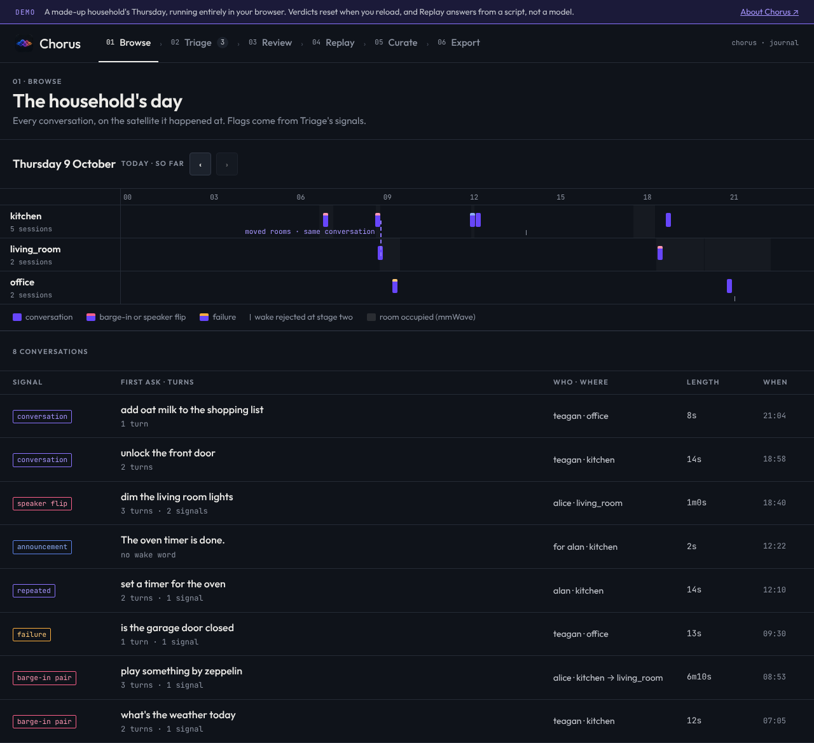

Three things differ from a household's own review box, and a notice above
every screen says so:

- verdicts live in the tab and are gone on reload;
- Replay asks `household.Model`, not Ollama: under the default prompt it
  answers each turn as the journal recorded it, and under an edited one as the
  model did once told to lead with the count, offer the first, and stop;
- the clock is fixed at 22:30 that Thursday, when the reviewer sits down.

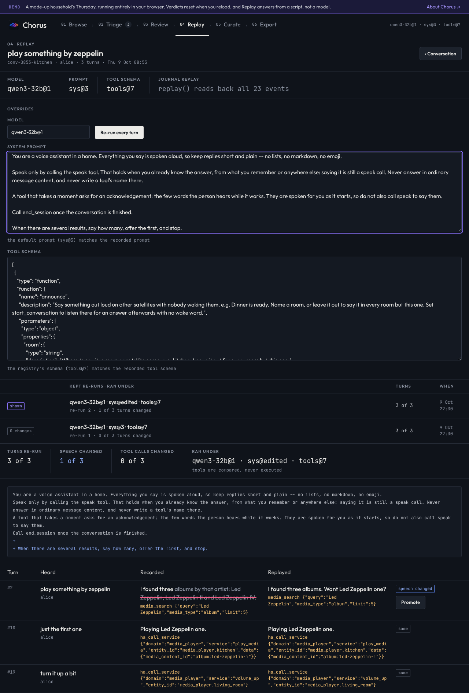

The audio is synthetic. `voice.json` scripts who says what and for how long,
and `task household:voice` speaks it with Kokoro, the TTS `chorusd` uses, into
16 kHz device PCM. A cut answer is spoken in two halves so the cut lands on
the word the journal recorded. `task household:voice:clone` gives the people
you name a voice cloned with Chatterbox from a reference recording of them,
fitted to the same lengths; it runs on your machine, and the clips it writes
are committed and public, so clone only voices whose owners said yes.

```sh norun
task demo:serve        # build into site/demo, serve http://127.0.0.1:8090/demo/
task household:voice   # re-speak the clips after editing voice.json
task household:voice -- --who alice --who assistant   # only theirs
task household:voice:clone -- --voice teagan=teagan.wav --voice alan=alan.wav
task household:voice:test   # the generators' own tests, with stand-in engines
```

The docs workflow builds the demo on every PR and publishes it with the site.
`demo_e2e_test.go` serves the built demo under the Pages path in a headless
Chrome, so a URL the shell fails to re-point is a 404 the test fails on.

## The screens

The header runs left to right in the order a reviewer usually works, and
badges the number of harvested pairs nobody has judged yet.

| Screen | Route | Answers |
|---|---|---|
| [Browse](#browse) | `/conversations` | What happened today, on which satellite, to whom? |
| [Triage](#triage) | `/queue` | Which of it is worth a person's time? |
| [Review](#review) | `/review` | Was this barge-in cut where the speaker actually stopped? |
| [Replay](#replay) | `/replays` | Would a different prompt or model have done better? |
| [Curate](#curate) | `/curate/pairs` | Does this pair go in the dataset, and as which answer? |
| [Export](#export) | `/export` | What ships, and what is being held back? |

### Browse

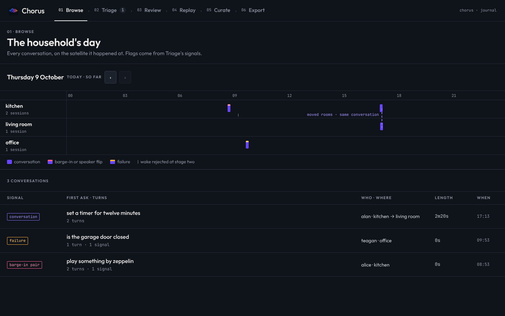

One lane per satellite across the day, `?day=YYYY-MM-DD` for any other.
Each block is a stretch of one conversation on one satellite, so a person
walking from the kitchen to the office shows up as one conversation in two
lanes. A block takes the colour of its most important signal: a barge-in
first, since it is the training signal, then a failure, a repeated ask, a
slow answer, a speaker flip. Ticks mark wakes rejected at stage two (SPEC §9.3), which
opened no conversation and so live in the satellite's own `device:` log. The
shaded band behind a lane is when its mmWave radar saw someone in the room,
from the same log (ADR-0050). A gap inside an evening is the native API
dropping, not the room emptying. A satellite with no radar, such as a Voice
PE, has no band.

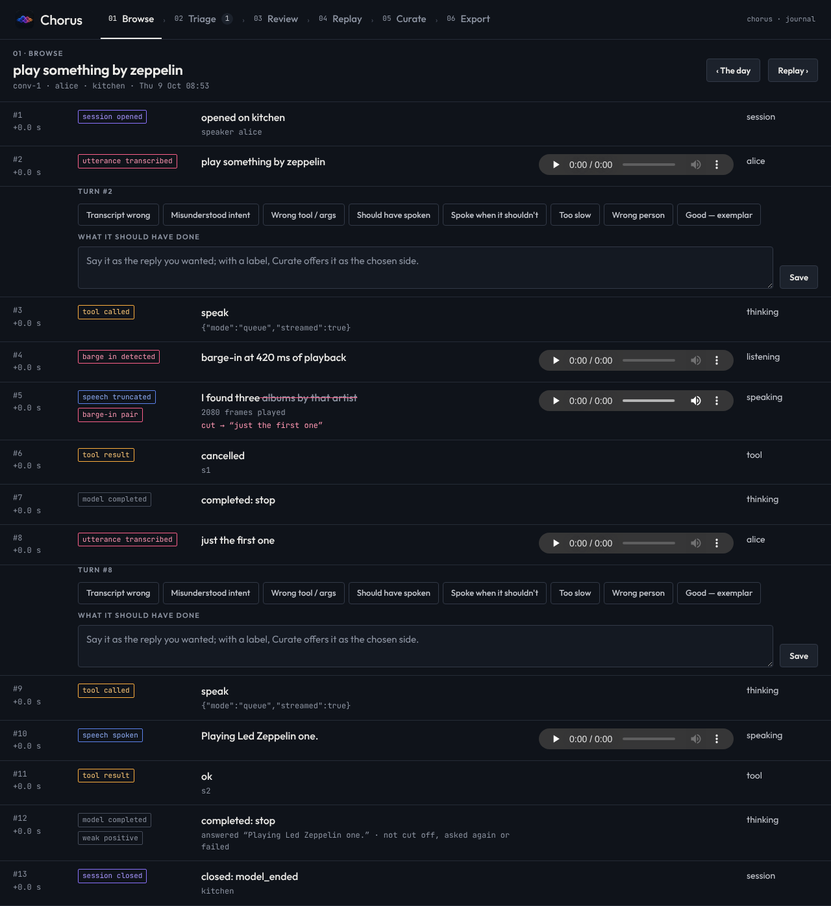

`/conversations/{id}` is one conversation's journal, event by event, with the
audio each event refers to. Every row carries a `#seq-N` anchor, which is how
Triage links straight to the event that raised a signal. Each answer's first
audio is its own row, saying how long the person waited.

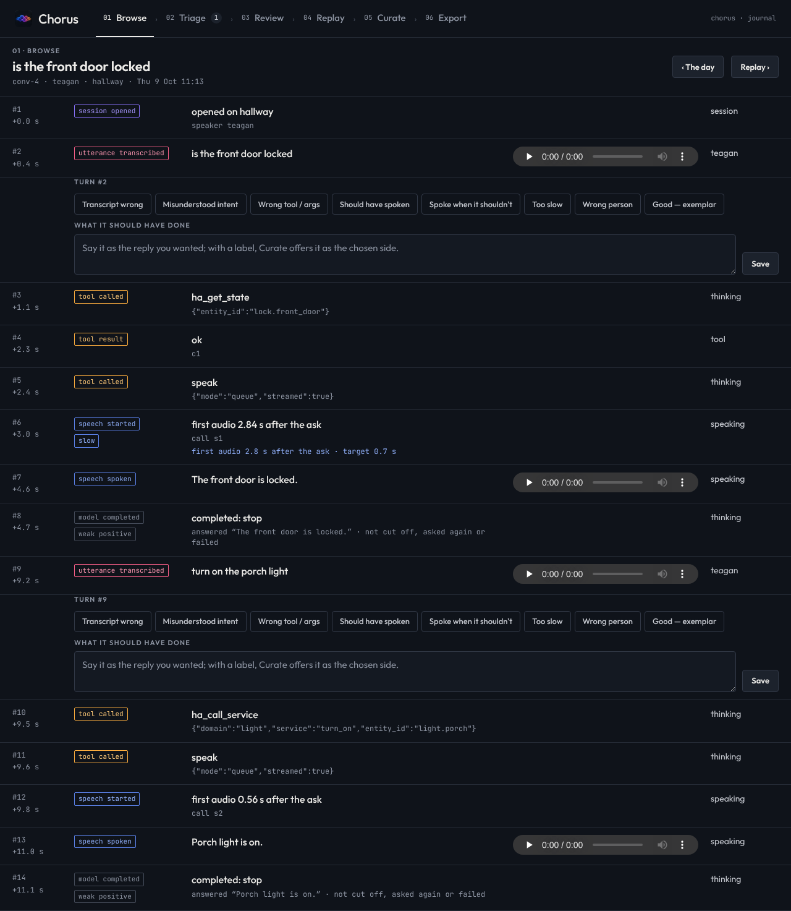

The log also shows what the model was told and what the house vouched for.
A `memory_recalled` row lists each memory the turn was told, whose it is
when someone shared it, and the earlier conversations it was told of. A
held call's `confirmation_requested` row names the call and its nonce, and
`confirmation_given` says which utterance the nonce was redeemed after: the
"did they actually say yes" audit (SPEC §6, ADR-0038). The summary written
when the conversation closed is its last row. Browse measures a
conversation to its close, not to the summary.

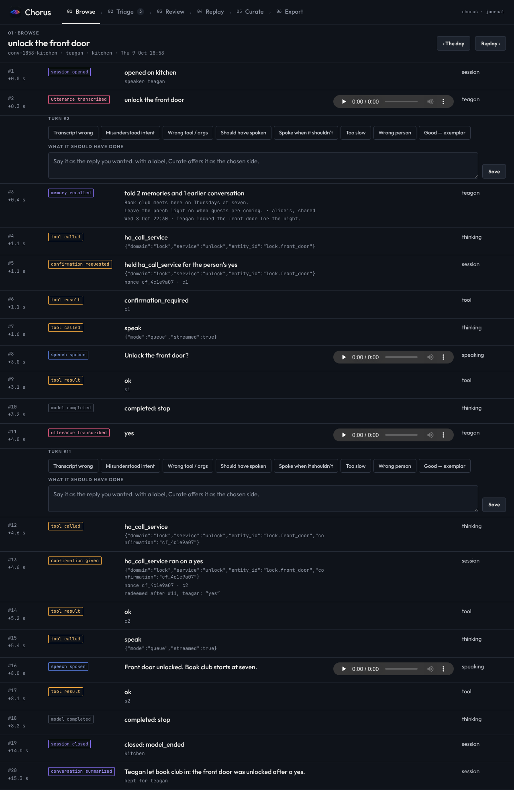

Under each utterance sit SPEC §9.2's labels for the turn it opens:
*transcript wrong*, *misunderstood intent*, *wrong tool / args*, *should
have spoken*, *spoke when it shouldn't*, *too slow*, *wrong person*, *good —
exemplar*, and a free-text "what it should have done". A turn with any fault
and a note becomes a pair in [Curate](#curate), the recorded take rejected
and the note chosen, so write the note as the reply you wanted. An exemplar
is a positive, not a pair (ADR-0052).

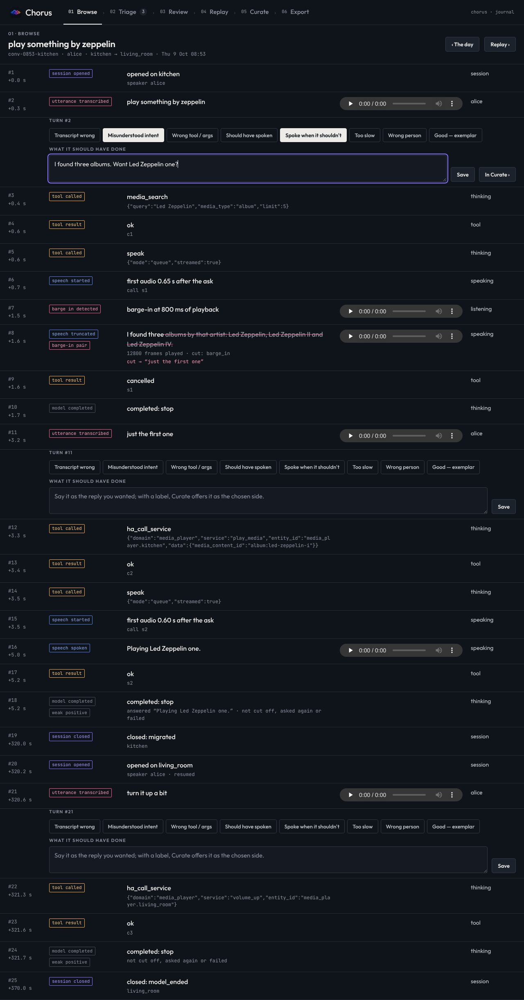

A timer going off, or someone asking for something to be said in another
room, opens a session with no wake word (ADR-0045). Browse lists it as an
*announcement*, named by what it said and whom it was for. Its log says why
it was said. Timers live in the household's own log, `house:timers`, which
Browse does not list. Its events appear in the conversations they name, as
`house #N` rows: the timer being set beside the `timer_start` call, and its
going off in the session that said it. A timer nobody heard is a failure in
Triage, which opens the house log at the event.

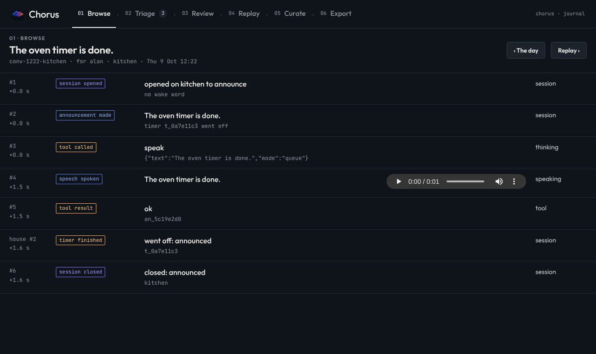

### Triage

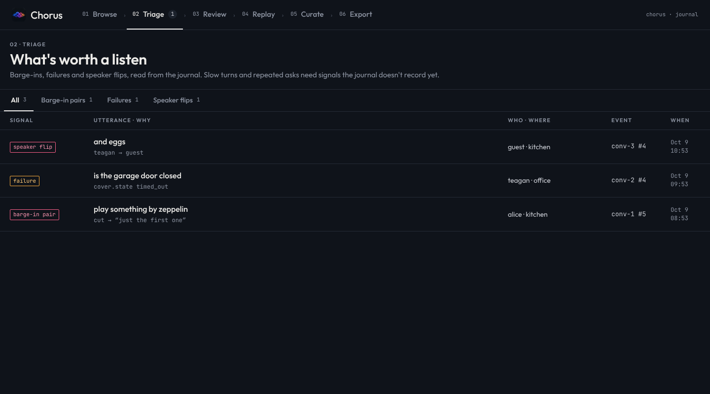

Every conversation in the household scanned for five signals
(`internal/triage`), newest first, filterable by tab:

| Signal | Raised when | Opens |
|---|---|---|
| barge-in | someone interrupted the assistant mid-turn | the pair in Review |
| failure | a tool errored or timed out (ADR-0008), the model finished with an error, or the session closed on an error or a lost device | the conversation at the failing event |
| repeated | the same person asked substantially the same thing again within 30 seconds | the conversation at the second ask |
| slow | the first audio of an answer came more than 700 ms after the person stopped speaking (SPEC §11, ADR-0035) | the conversation at the answer's first audio |
| speaker flip | the next utterance in a conversation came from a different person (ADR-0016) | the conversation at the flip |

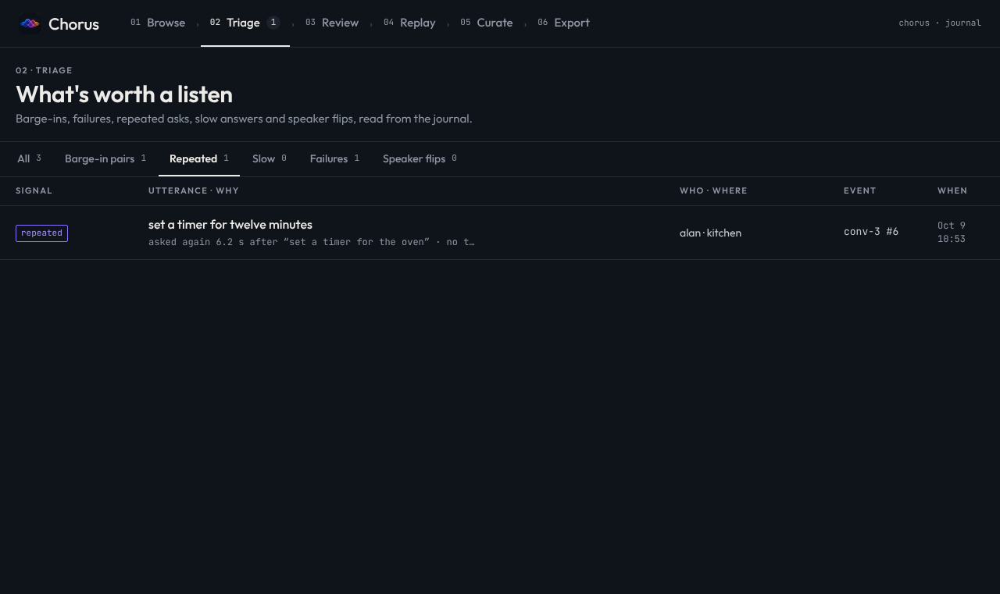
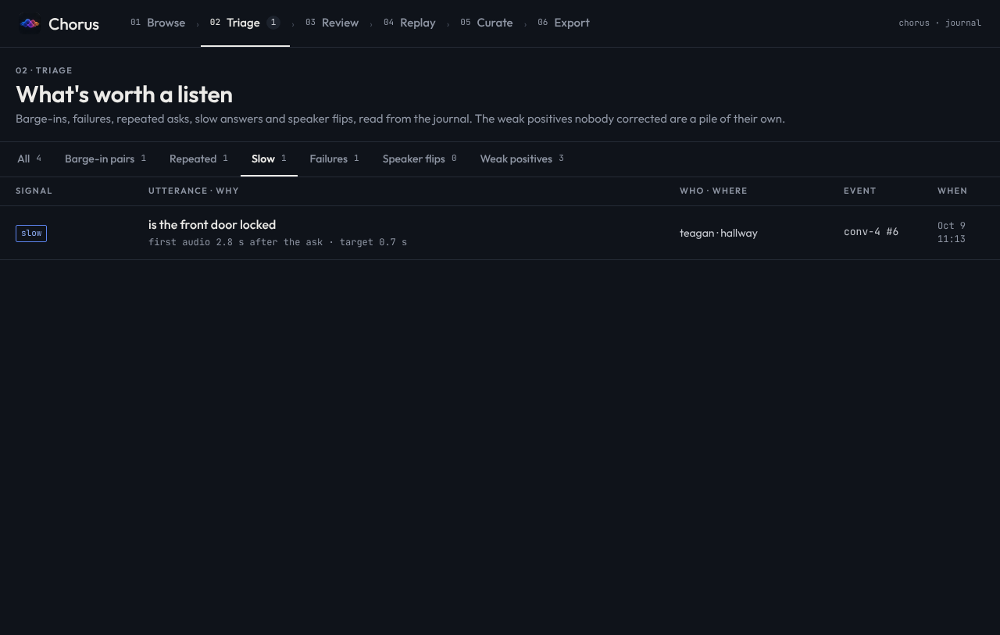

A signal is derived on read, never recorded. The slow signal reads
`speech_started`, which the Speaking child journals the moment the device
reports the turn's first frame played, with the wait since the person
stopped speaking as `wait_ms`.

### Review

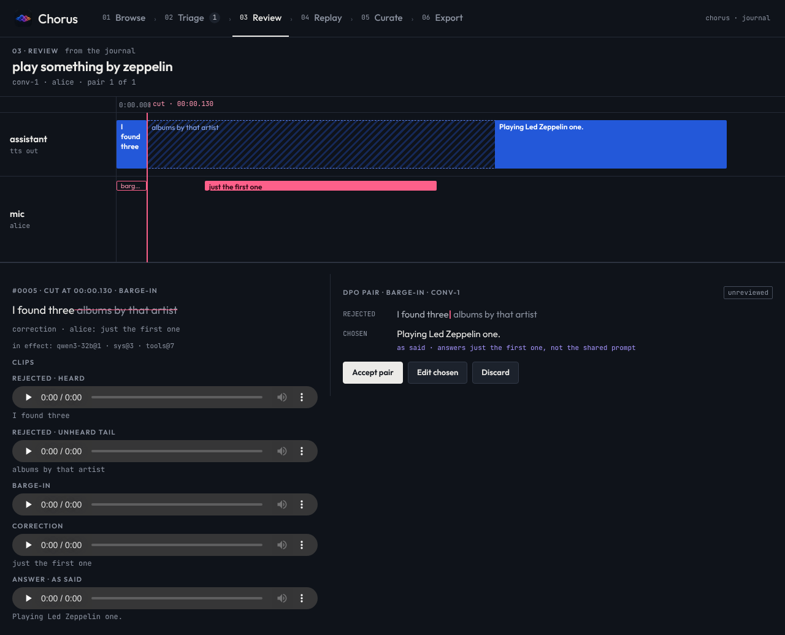

One harvested barge-in at a time (`?pair=` picks one; a reviewer's own pairs have no cut to hear, so Review skips them), laid out on a single
time axis: the assistant's turn with its unheard tail hatched, the mic track
with the interruption and the correction, the answering turn, and the cut.
The cut is the device's own report of the frame its DAC stopped on
(ADR-0005, ADR-0033), not the length of the text the model sent, and the
rejected clip plays only up to it. Offsets come from clip lengths and the
recorded barge-in position rather than wall clocks.

The pair flow from [Curate](#curate) sits beside the timeline, so a reviewer
can judge the pair where they heard it. What the cut turn was told it
remembers is listed under the inspector: a cut is judged against what the
model knew.

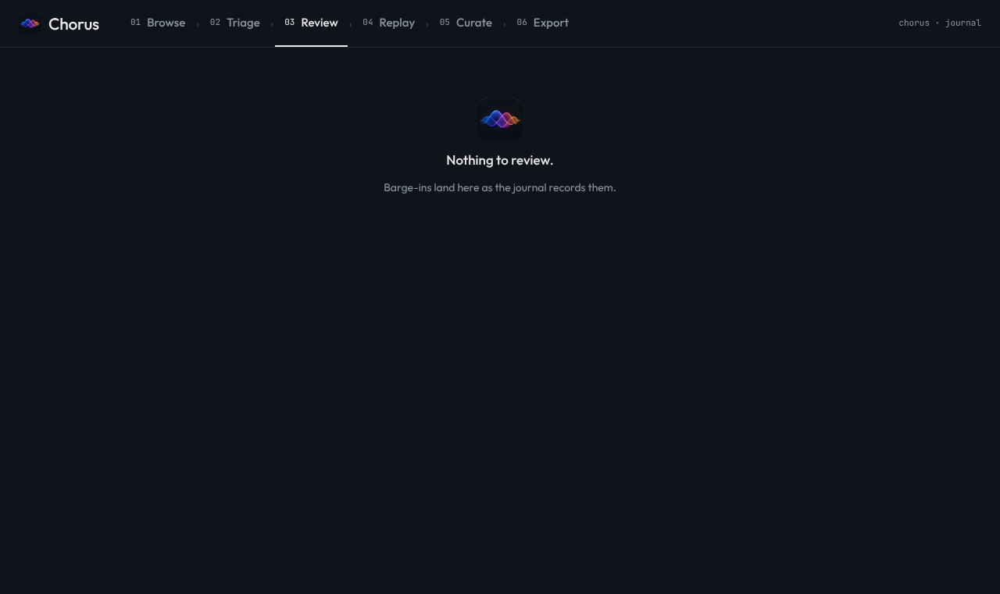

### Replay

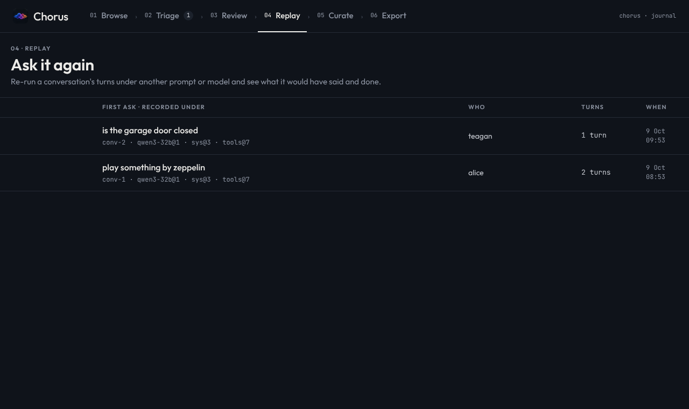

Edit-and-replay (SPEC §9.2, `internal/rerun`). Pick a conversation, edit the
system prompt or the model, and every recorded turn is asked again.

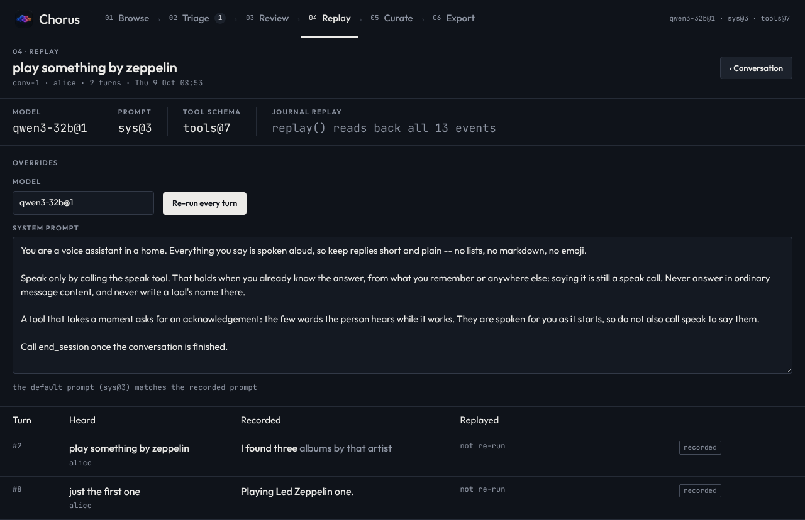
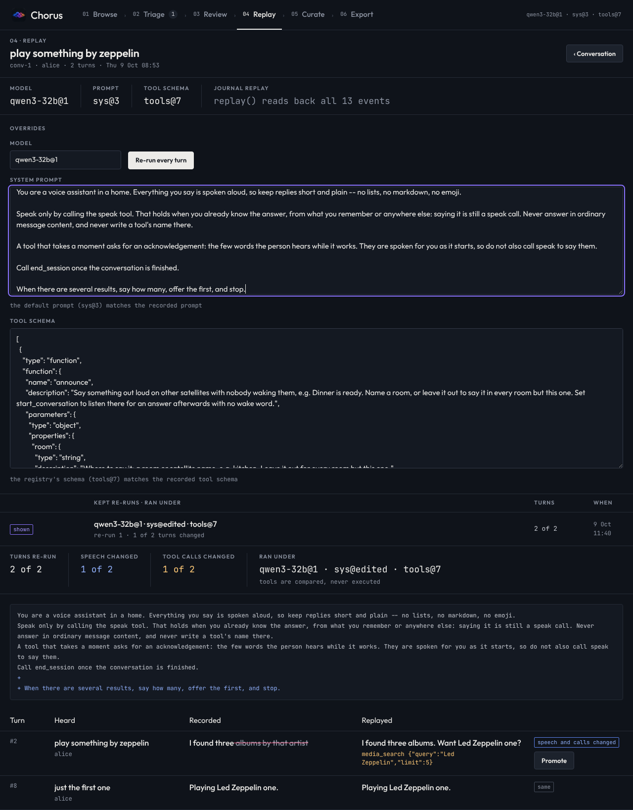

The result sets each turn's recorded speech and tool calls beside the
re-run's and says what changed. It is safe to point at the live model: a
turn is the system prompt plus one transcript, tool results never feed back
in, and so a re-run compares the calls the model *would* make without
executing any of them. A whole re-run is bounded at three minutes. Each
turn also lists what it was told it remembers, which the re-run is told too.

A turn whose re-run changed can be promoted. The re-run's take becomes the
chosen side of a pair whose rejected side is what the turn recorded on its
first ask, the take Replay set beside it, and it lands in Curate accepted, since promoting is the verdict. The take, the
calls it would make, the versions it ran under and the edited prompt itself
are stored, because the journal never held them (ADR-0052).

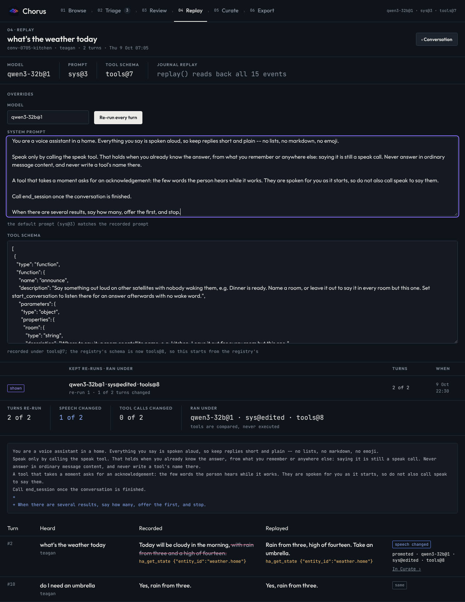

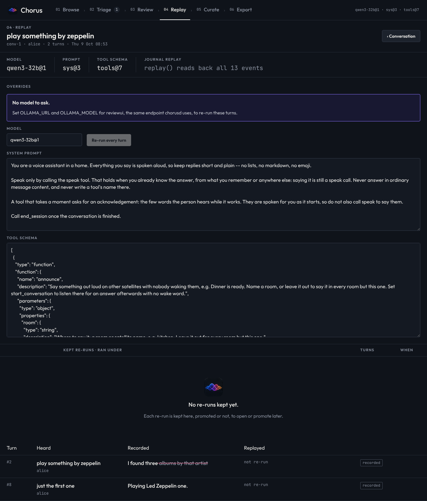

### Curate

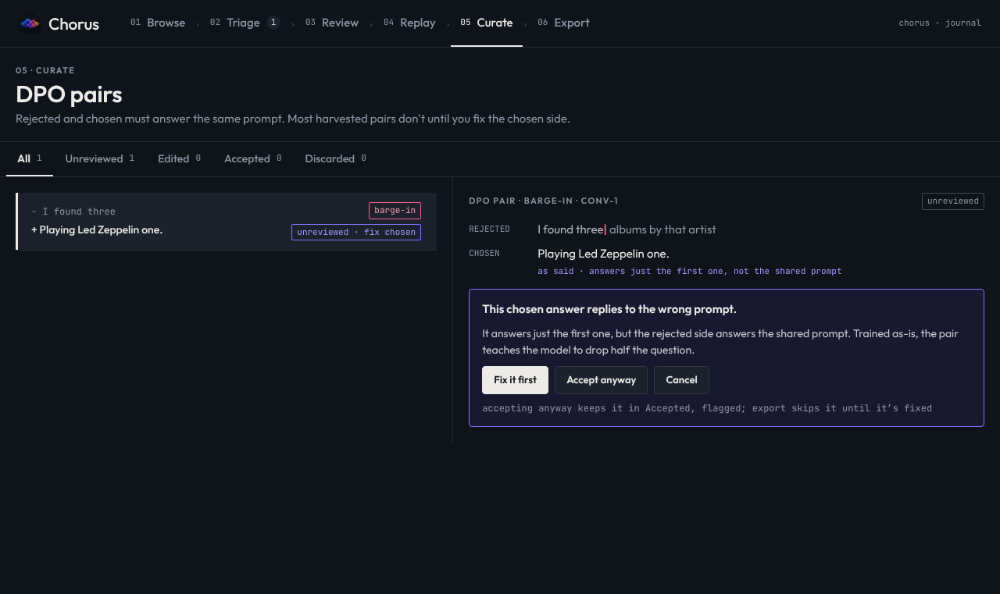

The harvested candidates on the left, the pair flow on the right. A pair is
the prompt, the turn the person rejected, and a chosen answer. Accept, edit
the chosen side, or discard with a reason (*barge-in was noise*, *not a
preference*, *duplicate*, *other*); undo takes a pair back to unreviewed.

The chosen side starts as what the assistant said *after* the correction,
which answers the correction rather than the original prompt (SPEC §9.1,
ADR-0026). Accepting it unchanged is the one mistake the flow exists to
block, so the reviewer meets a guard rather than an empty editor. Accepting
anyway is allowed and marks the pair unfixed, which Export holds back.

Pairs come from three places, named on each row: `barge-in`, harvested from
the log; `annotation`, a turn labelled with a fault and what it should have
done; and `replay`, a promoted re-run. A reviewer's pair shows what made it
under its chosen side. Changing an annotation's note asks for a new
verdict, since the old one judged a different chosen side.

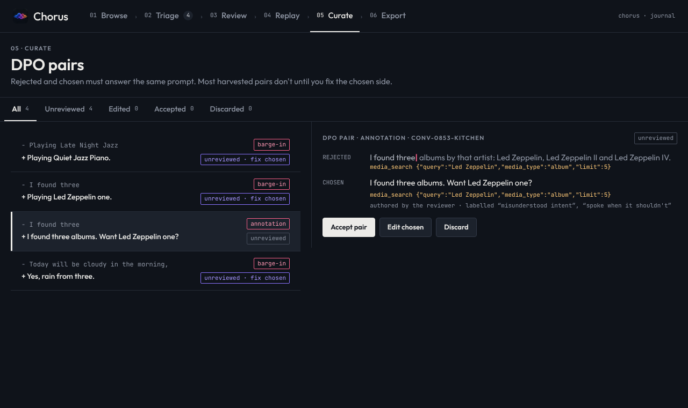

Verdicts are rows in the curation table, revisable where the journal is
append-only; unreviewed is the absence of a row (ADR-0034). Labels and
promoted takes are rows beside them (ADR-0052).

### Export

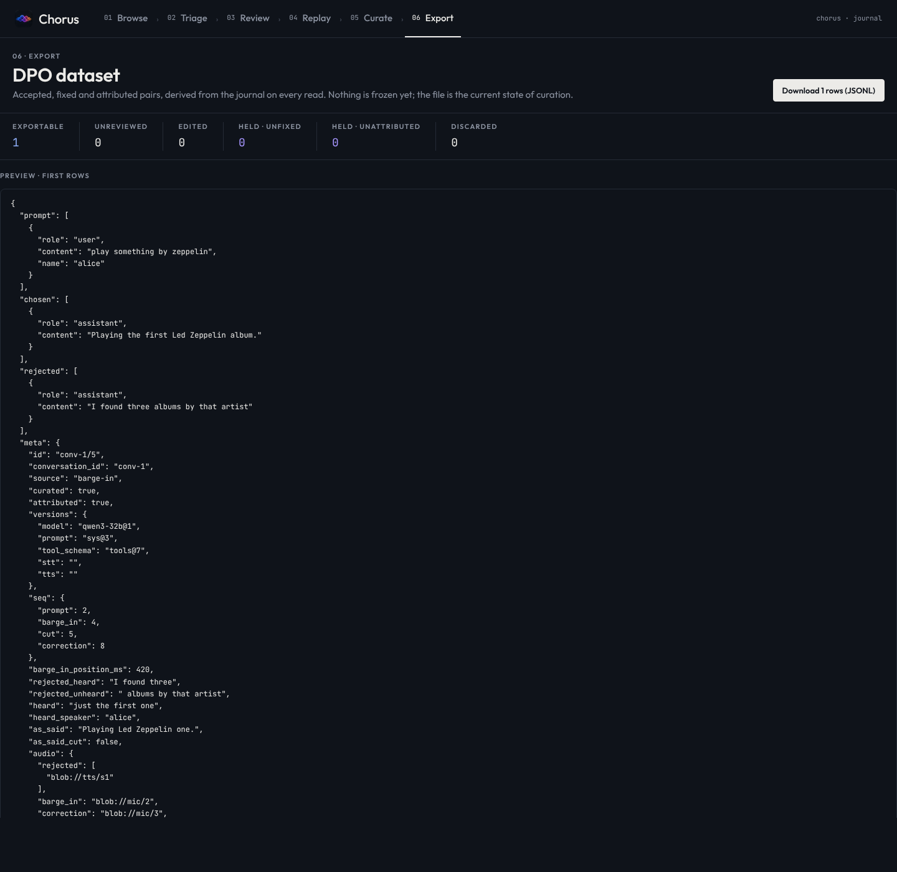

The dataset is every pair that is accepted, fixed, and attributed: the turn
recorded the STT, LLM and TTS versions that produced it (ADR-0032), so a
trainer can hold a configuration responsible. The page counts what each gate
holds back (unreviewed, still being edited, discarded, unfixed, unattributed)
and previews the first rows exactly as `/export/dpo.jsonl` writes them
(`harvest.Export`). This is the only curated export: `task harvest` writes
the same shape but raw, every candidate with `meta.curated=false` and no
chosen side, which a DPO loader cannot train on. An annotation's row carries
its labels in `meta.labels`; a replay's carries the re-run's configuration
and calls in `meta.chosen_versions` and `meta.chosen_calls`, and is
attributed only when both sides are.

## The UI kit

`internal/reviewui/ui` is the component kit the screens are built from:
html/template partials, one stylesheet per component, and the view-model
type each partial executes against. A component is three files sharing a
name:

```
ui/<name>.go                          view model (the template's dot)
ui/templates/components/<name>.tmpl   {{define "<name>"}} partial
ui/static/css/components/<name>.css   styles, built on tokens.css
```

`ui/demo` builds the design mock's data as view models; the kit's own tests
render every component from it. `internal/reviewui/audio` frames raw journal
PCM as WAV on the way out, because a browser cannot play the device format
and the store stays raw.

## Tests

Three layers, all over the same household fixtures (`internal/reviewui/household`, the day the demo serves):
named people, real rooms, real tool calls, barge-ins cut where a DAC would
cut them.

| Layer | Where | Proves |
|---|---|---|
| handlers | `cmd/reviewui/*_test.go`, in `task test` | what the server writes, against in-memory stores |
| database | `replay_db_test.go`, `internal/curation`, in `task test:db` | the same screens over real Postgres |
| browser | `e2e_test.go`, `e2e_journeys_test.go`, in `task test:e2e` | what a reviewer gets: htmx loaded and swapping, audio a browser decodes, links that land where they say |

The browser tier drives a headless Chrome with chromedp and skips unless
`CHORUS_E2E_CHROME` names a browser; CI sets it, so there it fails rather
than skips. `CHORUS_E2E_SHOTS` keeps a full-page screenshot of every step,
and CI uploads them as the `reviewui-screens` artifact.

```sh norun
CHORUS_E2E_CHROME=$(command -v chromium) task test:e2e
CHORUS_E2E_CHROME=$(command -v chromium) CHORUS_E2E_SHOTS=/tmp/shots task test:e2e
```

`e2e_test.go` checks each screen on its own. `e2e_journeys_test.go` walks a
reviewer through a whole day, start to finish:

- triage a barge-in, open it in Review, fix the chosen side, and accept it;
- curate every pair, discarding one, then download the dataset;
- export holds back the unfixed and unattributed pairs;
- cancel and undo leave no verdict behind;
- Review walks every cut in turn;
- every Triage signal opens where it happened;
- Browse follows a person across satellites and walks back through the days;
- the oven timer goes off in an empty kitchen, and is shown set where it was;
- the front door waits for Teagan's yes, and the log shows the whole audit;
- a turn is labelled, its note becomes a pair, and the pair ships with its labels;
- a re-run is promoted, lands accepted, and ships saying which prompt wrote it.

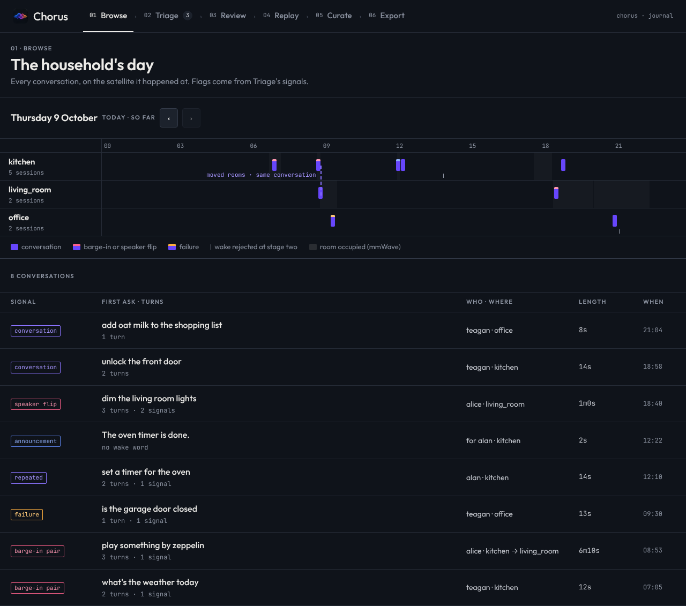
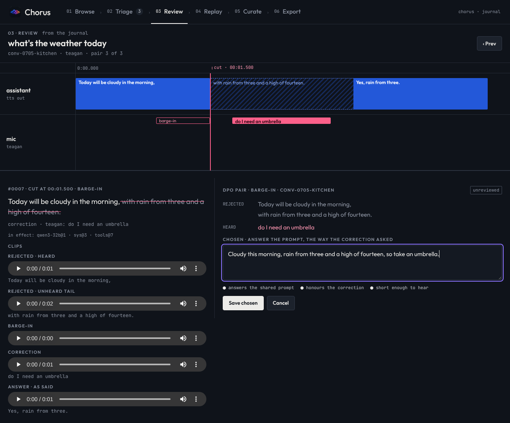

The screenshots in this directory come from those runs. A PR that changes a
screen replaces its screenshot here and shows it in the PR description.
